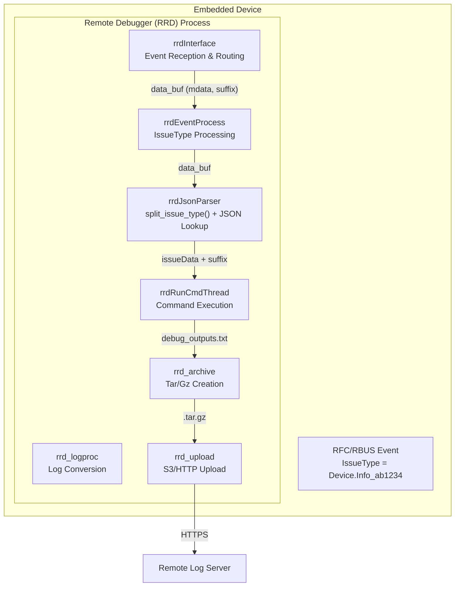

# Remote Debugger Supports UUID Information in Debug Report File — High-Level Design Document

## Document Information

| Field             | Value                                   |
|-------------------|-----------------------------------------|
| **Feature**       | Optional Underscore-Delimited Suffix on IssueType |
| **Component**     | Remote Debugger (RRD)                   |
| **Version**       | 1.0                                     |
| **Date**          | May 2026                                |
| **Target Platform** | Embedded Linux Systems               |

---

## 1. Executive Summary

This document describes the high-level design for adding support for an **optional, underscore-delimited suffix** appended to the `IssueType` RFC value (e.g., `Device.DeviceInfo_ab1234`). The suffix is parsed, validated, sanitized, and carried through the entire event-processing pipeline so that it can be re-appended to the generated upload archive filename. Additionally, systemd unit names are disambiguated using an epoch timestamp, and the debug output file open-mode is corrected to prevent stale data accumulation.

---

## 2. Background and Motivation

### 2.1 Problem Statement

Previously, the `IssueType` RFC parameter was expected to contain a simple, period-delimited string (e.g., `Device.DeviceInfo`). Operators needed a way to attach additional context (e.g., a ticket number or short identifier) directly to the event value so that the resulting debug archive could be uniquely correlated with an external issue tracker without modifying the core node/sub-node classification logic.

### 2.2 Goals

1. Parse and validate an optional `_<suffix>` token appended to the IssueType string.
2. Sanitize the suffix to prevent shell injection when it is embedded in filenames or commands.
3. Propagate the suffix through the event pipeline to the archive upload step.
4. Append the suffix to the upload archive filename so the remote server can correlate the archive with the originating issue context.
5. Disambiguate systemd transient unit names to avoid conflicts when the same IssueType is processed concurrently or repeatedly.

### 2.3 Non-Goals

- Changing the node/sub-node classification logic.
- Supporting suffixes longer than 9 characters (including the leading `_`).
- Modifying the upstream RFC parameter interface.

---

## 3. Architecture Overview

### 3.1 System Context



### 3.2 Module Responsibilities

| Module | File(s) | Responsibility |
|--------|---------|----------------|
| Event Interface | `rrdInterface.c` | Receives RBUS/RFC events; initialises and de-allocates `data_buf`; propagates `suffix = NULL` initially |
| Event Processor | `rrdEventProcess.c` | Splits IssueType list; calls `split_issue_type()`; populates `data_buf.suffix`; routes to JSON parser |
| JSON Parser | `rrdJsonParser.c` | Implements `split_issue_type()`; resolves node/sub-node; builds upload filename with suffix |
| Command Thread | `rrdRunCmdThread.c` | Executes debug commands via systemd-run; writes `debug_outputs.txt` (w+ mode); appends epoch to unit name |
| Log Processor | `rrd_logproc.c` | Converts IssueType to safe filename characters; preserves hyphens for suffix UUID tokens |
| Archive Manager | `rrd_archive.c` | Creates `.tar.gz` archive of the output directory |
| Upload Manager | `rrd_upload.c` | Uploads the archive to the remote log server |
| Common Types | `rrdCommon.h` | Defines `data_buf` struct with new `suffix` field |

---

## 4. Data Flow

### 4.1 Nominal Flow (with suffix)

```
RFC set: Device.DeviceInfo_ab1234
       |
       v
rrdInterface._remoteDebuggerEventHandler()
  → RRD_data_buff_init()  [suffix = NULL]
  → pushIssueTypesToMsgQueue("Device.DeviceInfo_ab1234", EVENT_MSG)
       |
       v
rrdEventProcess.processIssueTypeEvent()
  → issueTypeSplitter("Device.DeviceInfo_ab1234", ',', &cmdMap)
  → for each token: split_issue_type(token, base, suffix)
      base   = "Device.DeviceInfo"
      suffix = "_ab1234"
  → cmdBuff->mdata  = "Device.DeviceInfo"
  → cmdBuff->suffix = "_ab1234"
  → processIssueType(cmdBuff)
       |
       v
rrdJsonParser.checkIssueNodeInfo()
  → Reads JSON profile for "Device.DeviceInfo"
  → outdir = "/tmp/rrd/DeviceInfo-DebugReport-2026-05-13-10-00-00"
  → executeCommands() / invokeSanityandCommandExec()
       |
       v
rrdRunCmdThread.executeCommands()
  → unit = "remote_debugger_DeviceInfo_<epoch>"
  → systemd-run --unit=remote_debugger_DeviceInfo_<epoch> ...
  → journalctl -u remote_debugger_DeviceInfo_<epoch>
  → fopen(debug_outputs.txt, "w+")
       |
       v
rrdJsonParser.checkIssueNodeInfo()  [after exec]
  → tarName = "Device.DeviceInfo" + "_ab1234"
            = "Device.DeviceInfo_ab1234"
  → uploadDebugoutput(outdir, "Device.DeviceInfo_ab1234")
       |
       v
rrd_logproc.rrd_logproc_convert_issue_type("Device.DeviceInfo_ab1234")
  → "DEVICE_DEVICEINFO_AB1234"   (hyphens also preserved)
       |
       v
rrd_upload / rrd_archive
  → Archive: AABBCCDDEEFF_DEVICE_DEVICEINFO_AB1234.tar.gz
  → Upload to remote server
```

### 4.2 Nominal Flow (without suffix)

Same as above with:
- `split_issue_type()` returns `suffix = ""`
- `tarName = "Device.DeviceInfo"` (no suffix appended)
- Archive: `AABBCCDDEEFF_DEVICE_DEVICEINFO.tar.gz`

---

## 5. Key Algorithms and Data Structures

### 5.1 `data_buf` Structure (updated)

```c
typedef struct mbuffer {
    message_type_et     mtype;
    char               *mdata;      /* IssueType base (no suffix) */
    char               *jsonPath;
    bool                inDynamic;
    bool                appendMode;
    deepsleep_event_et  dsEvent;
    char               *suffix;     /* NEW: optional "_<token>", heap-allocated or NULL */
} data_buf;
```

**Lifecycle of `suffix`:**
- Initialised to `NULL` by `RRD_data_buff_init()`.
- Allocated (via `strdup`) inside `processIssueTypeEvent()` when a non-empty suffix is present.
- Freed in all exit paths of `checkIssueNodeInfo()` and `processIssueTypeInInstalledPackage()`.
- Also freed by `RRD_data_buff_deAlloc()` for callers using the generic de-allocation path.

### 5.2 `split_issue_type()` Algorithm

```
INPUT:  input     – raw IssueType string (e.g. "Device.DeviceInfo_ab1234")
        base_len  – size of base buffer
        suffix_len – size of suffix buffer
OUTPUT: base   – part before first '_' (or full input if no '_')
        suffix – part from first '_' onwards IF len ≤ RRD_MAX_SUFFIX_LEN (9),
                 sanitized to [A-Za-z0-9_-]; otherwise ""

ALGORITHM:
1.  Initialise base[0] = '\0', suffix[0] = '\0'.
2.  Validate pointers and buffer sizes; return on failure.
3.  Find first '_' in input using strchr().
4.  If found:
    a. Copy characters before '_' into base (capped at base_len-1).
    b. If strlen(underscore_ptr) ≤ RRD_MAX_SUFFIX_LEN:
         Iterate over underscore_ptr:
           Accept char if isalnum() || '_' || '-'
           Else discard (injection prevention)
         Null-terminate suffix.
    c. Else:
         Log debug message; suffix = "".
5.  If not found:
    Copy full input into base (capped at base_len-1); suffix = "".
```

**Constant:**
```c
#define RRD_MAX_SUFFIX_LEN  9   /* maximum strlen() of the suffix, measured from the
                                   leading '_' inclusive — e.g. "_ab12345" has strlen 8 */
```

The length check is `strlen(underscore_ptr) <= RRD_MAX_SUFFIX_LEN`, where `underscore_ptr` points at the `_` character. Therefore the `_` itself is part of the measured length and the token portion may be at most 8 characters long (e.g. `_ab12345` → strlen 8 ≤ 9 → accepted).

**Examples:**

| Input | Base | Suffix | `strlen` from `_` | Decision |
|-------|------|--------|-------------------|----------|
| `Device.DeviceInfo_ab1234` | `Device.DeviceInfo` | `_ab1234` | 7 ≤ 9 | accepted |
| `Device.DeviceInfo_ab12345` | `Device.DeviceInfo` | `_ab12345` | 8 ≤ 9 | accepted |
| `Device.DeviceInfo_ab;rm` | `Device.DeviceInfo` | `_abrm` | 5 ≤ 9; `;` stripped | accepted (sanitised) |
| `Device.DeviceInfo_uuid-long` | `Device.DeviceInfo` | `` | 21 > 9 | discarded |
| `Device.DeviceInfo` | `Device.DeviceInfo` | `` | no `_` present | no suffix |

### 5.3 Systemd Unit Name Disambiguation

```c
time_t epochTime = time(NULL);
/* Note: time() returns (time_t)-1 on error; snprintf will render it as "-1",
   which is still a valid unique string and causes no functional regression —
   the unit name will be unusual but won't conflict with other invocations. */
snprintf(remoteDebuggerServiceStr, sizeof(remoteDebuggerServiceStr),
         "%s%s%ld", remoteDebuggerPrefix, cmdData->rfcvalue, (long)epochTime);
/* Result: "remote_debugger_DeviceInfo_1715600000" */
```

Previously the unit name was static per `rfcvalue`, causing `systemctl start` collisions when the same IssueType was processed in rapid succession. Appending the epoch timestamp guarantees uniqueness per invocation.

### 5.4 `debug_outputs.txt` Open Mode Change

| Before | After | Reason |
|--------|-------|--------|
| `fopen(finalOutFile, "a+")` | `fopen(finalOutFile, "w+")` | Truncate-on-open prevents stale output from a previous run contaminating the current report |

### 5.5 Hyphen Preservation in `rrd_logproc_convert_issue_type()`

```c
/* Before: hyphens were dropped (only alnum and '_'/'.' were mapped) */
/* After:  hyphens are preserved so suffix UUID tokens remain distinct */
else if (c == '-') output[j++] = '-';
```

---

## 6. Component Interaction and Interfaces

### 6.1 Public API Changes

| Symbol | File | Change |
|--------|------|--------|
| `split_issue_type()` | `rrdJsonParser.h / .c` | **New** function |
| `data_buf.suffix` | `rrdCommon.h` | **New** field (`char *`) |
| `RRD_data_buff_init()` | `rrdInterface.c` | Sets `sbuf->suffix = NULL` |
| `RRD_data_buff_deAlloc()` | `rrdInterface.c` | `free(sbuf->suffix)` added |

### 6.2 Internal Call Chain

```
processIssueTypeEvent()
  └─ split_issue_type()              [rrdJsonParser.c]
  └─ processIssueType()              [rrdEventProcess.c]
       └─ processIssueTypeInStaticProfile()
            └─ checkIssueNodeInfo()  [rrdJsonParser.c]
                 └─ executeCommands() / invokeSanityandCommandExec()
                 └─ uploadDebugoutput(outdir, tarName)
                      └─ rrd_logproc_convert_issue_type()
                      └─ rrd_archive_create()
                      └─ rrd_upload_file()
```

---


## 7. Glossary

| Term | Definition |
|------|-----------|
| IssueType | RFC parameter string identifying the debug category (e.g., `Device.DeviceInfo`) |
| Suffix | Optional `_<token>` appended to IssueType (e.g., `_ab1234`), used to distinguish archive names |
| base | The IssueType string before the first `_`; used for JSON profile lookup |
| RFC | Remote Feature Control — device configuration parameter infrastructure |
| RBUS | RDK Message Bus — event delivery mechanism on RDK devices |
| RRD | RDK Remote Debugger — this component |
| tarName | The logical name used when creating and uploading the debug archive |
| data_buf | Internal message buffer passed between RRD processing stages |
