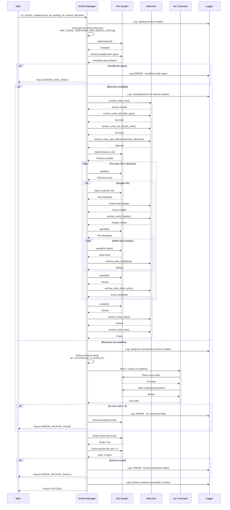
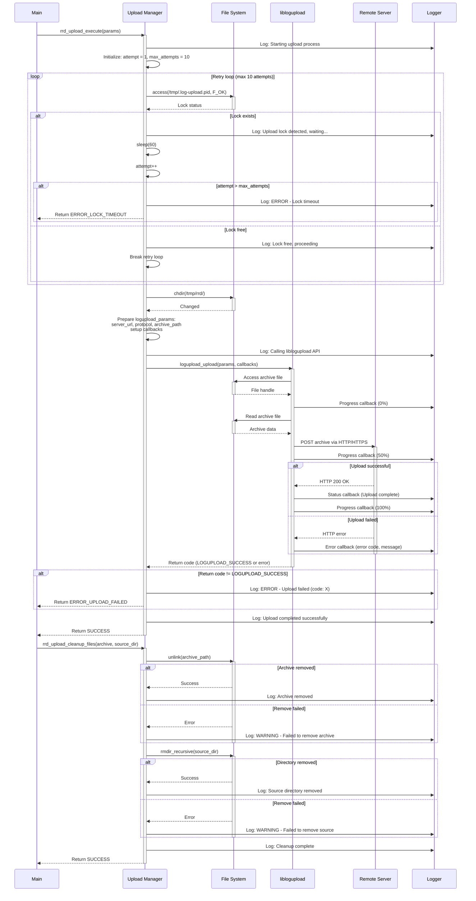

# uploadRRDLogs - Sequence Diagrams

## Document Information
- **Component Name:** uploadRRDLogs (C Implementation)
- **Version:** 1.0
- **Date:** December 1, 2025

## 1. Overall System Sequence Diagram

### 1.1 Complete Upload Process (Mermaid)

```mermaid
sequenceDiagram
    actor User
    participant Main as Main Process
    participant Config as Config Manager
    participant SysInfo as System Info Provider
    participant LogProc as Log Processor
    participant Archive as Archive Manager
    participant Upload as Upload Manager
    participant LibLogUpload as liblogupload Library
    participant Log as Logger
    participant FS as File System
    participant Remote as Remote Server

    User->>Main: Execute uploadRRDLogs<br/>UPLOADDIR ISSUETYPE
    activate Main
    
    Main->>Main: Validate Arguments
    alt Invalid Arguments
        Main->>User: Print Usage, Exit 1
    end
    
    Main->>Log: Initialize Logging
    activate Log
    Log->>FS: Open remote-debugger.log
    FS-->>Log: File Handle
    Log-->>Main: Ready
    
    Main->>Config: Load Configuration
    activate Config
    Config->>FS: Read /etc/include.properties
    FS-->>Config: Properties
    Config->>FS: Read /etc/device.properties
    FS-->>Config: Properties
    
    alt Non-prod OR No /opt/dcm.properties
        Config->>Config: Query RFC via RBus API<br/>LogServerUrl, SsrUrl
        Config->>FS: Read /tmp/DCMSettings.conf
        FS-->>Config: DCM Settings
    else Prod with /opt/dcm.properties
        Config->>FS: Read /opt/dcm.properties
        FS-->>Config: DCM Properties
    end
    
    alt Config incomplete
        Config->>FS: Read /etc/dcm.properties (fallback)
        FS-->>Config: DCM Properties
    end
    
    Config-->>Main: Configuration Data
    deactivate Config
    
    Main->>SysInfo: Get MAC Address
    activate SysInfo
    SysInfo->>SysInfo: Query TR-181 params via RBus<br/>OR call GetEstbMac() API
    SysInfo-->>Main: MAC Address
    
    Main->>SysInfo: Get Timestamp
    SysInfo->>SysInfo: Generate YYYY-MM-DD-HH-MM-SS
    SysInfo-->>Main: Timestamp
    deactivate SysInfo
    
    Main->>LogProc: Validate Source Directory
    activate LogProc
    LogProc->>FS: Check directory exists
    FS-->>LogProc: Exists
    LogProc->>FS: Check directory not empty
    FS-->>LogProc: Has files
    
    alt Empty or Missing
        LogProc->>Log: Log Directory Empty
        LogProc-->>Main: Error
        Main->>User: Exit 0
    end
    
    LogProc->>LogProc: Convert Issue Type to Uppercase
    
    alt Issue Type == LOGUPLOAD_ENABLE
        LogProc->>FS: Check RRD_LIVE_LOGS.tar.gz
        FS-->>LogProc: File exists
        LogProc->>FS: Move to source directory
        FS-->>LogProc: Moved
        LogProc->>Log: Log live logs included
    end
    
    LogProc-->>Main: Source Ready
    deactivate LogProc
    
    Main->>Archive: Create Archive
    activate Archive
    Archive->>Archive: Generate Filename<br/>MAC_ISSUE_TIMESTAMP_RRD_DEBUG_LOGS.tgz
    Archive->>FS: Change to /tmp/rrd/
    FS-->>Archive: Changed
    
    alt Using libarchive
        Archive->>Archive: Initialize libarchive
        Archive->>FS: Open archive file
        FS-->>Archive: File handle
        Archive->>FS: Open source directory
        FS-->>Archive: Directory handle
        
        loop For each file
            Archive->>FS: Read file entry
            FS-->>Archive: File info
            Archive->>FS: Open source file
            FS-->>Archive: File data
            Archive->>Archive: Write to archive (streaming)
            Archive->>FS: Close source file
        end
        
        Archive->>FS: Close archive
        FS-->>Archive: Closed
    else Using tar command
        Archive->>ExtScript: Execute tar -zcf
        activate ExtScript
        ExtScript->>FS: Read source files
        FS-->>ExtScript: File data
        ExtScript->>FS: Write archive
        FS-->>ExtScript: Written
        ExtScript-->>Archive: Exit code 0
        deactivate ExtScript
    end
    
    Archive->>FS: Verify archive exists
    FS-->>Archive: Verified
    Archive->>Log: Log archive created
    Archive-->>Main: Archive Path
    deactivate Archive
    
    Main->>Upload: Upload Archive
    activate Upload
    
    loop Retry up to 10 times
        Upload->>FS: Check /tmp/.log-upload.pid
        FS-->>Upload: Lock status
        
        alt Lock exists
            Upload->>Log: Log waiting for lock
            Upload->>Upload: Sleep 60 seconds
        else Lock free
            Upload->>Upload: Exit retry loop
        end
    end
    
    alt Lock timeout
        Upload->>Log: Log timeout error
        Upload-->>Main: Error
        Main->>FS: Cleanup files
        Main->>User: Exit 4
    end
    
    Upload->>FS: Change to /tmp/rrd/
    FS-->>Upload: Changed
    
    Upload->>LibLogUpload: logupload_upload()<br/>with archive, server, callbacks
    activate LibLogUpload
    LibLogUpload->>Remote: HTTP/HTTPS POST archive
    activate Remote
    Remote-->>LibLogUpload: Upload response
    deactivate Remote
    LibLogUpload->>Upload: Progress/Status callbacks
    LibLogUpload-->>Upload: Return code
    deactivate LibLogUpload
    
    alt Upload failed
        Upload->>Log: Log upload failure
        Upload->>FS: Remove archive
        Upload->>FS: Remove source directory
        Upload-->>Main: Error
        Main->>User: Exit 4
    else Upload succeeded
        Upload->>Log: Log upload success
        Upload->>FS: Remove archive
        Upload->>FS: Remove source directory
        Upload-->>Main: Success
    end
    
    deactivate Upload
    
    Main->>Log: Close log file
    Log->>FS: Close remote-debugger.log
    deactivate Log
    
    Main->>User: Exit 0
    deactivate Main
```



```
USER                    MAIN             CONFIG          SYSINFO         LOGPROC         ARCHIVE         UPLOAD          LIBLOGUPLOAD    FILESYSTEM      LOGGER
  |                      |                |               |               |               |               |               |               |               |
  |--Execute------------>|                |               |               |               |               |               |               |               |
  |  uploadRRDLogs       |                |               |               |               |               |               |               |               |
  |  UPLOADDIR ISSUETYPE |                |               |               |               |               |               |               |               |
  |                      |                |               |               |               |               |               |               |               |
  |                      |---Validate-----|               |               |               |               |               |               |               |
  |                      |   Arguments    |               |               |               |               |               |               |               |
  |                      |                |               |               |               |               |               |               |               |
  |                      |----------------|---------------|---------------|---------------|---------------|---------------|---------------|-------------->|
  |                      |                                                                                                                    Initialize   |
  |                      |                                                                                                                    Logging      |
  |                      |<----------------------------------------------------------------------------------------------------------------------------------------------|
  |                      |                |               |               |               |               |               |               |               |
  |                      |---Load-------->|               |               |               |               |               |               |               |
  |                      |   Config       |               |               |               |               |               |               |               |
  |                      |                |---------------|---------------|---------------|---------------|---------------|-------------->|               |
  |                      |                |                                                                                   Read properties             |
  |                      |                |<-------------------------------------------------------------------------------|               |               |
  |                      |                |               |               |               |               |               |               |               |
  |                      |                |---Query RFC via RBus API------|---------------|---------------|---------------|               |               |
  |                      |                |   (LogServerUrl, SsrUrl)      |               |               |               |               |               |
  |                      |                |<---RFC values------------------|               |               |               |               |               |
  |                      |                |               |               |               |               |               |               |               |
  |                      |<---Config------|               |               |               |               |               |               |               |
  |                      |    Data        |               |               |               |               |               |               |               |
  |                      |                |               |               |               |               |               |               |               |
  |                      |----------------|-------------->|               |               |               |               |               |               |
  |                      |                                Get MAC Address |               |               |               |               |               |
  |                      |                                |---Query TR-181 via RBus-------|---------------|---------------|               |               |
  |                      |                                |   OR GetEstbMac() API         |               |               |               |               |
  |                      |<-------------------------------|               |               |               |               |               |               |
  |                      |                                                |               |               |               |               |               |
  |                      |----------------|---------------|-------------->|               |               |               |               |               |
  |                      |                                                Validate Source |               |               |               |               |
  |                      |                                                |---------------|---------------|---------------|-------------->|               |
  |                      |                                                                                                    Check dir    |               |
  |                      |                                                |<------------------------------------------------------------------------------|
  |                      |<-------------------------------|---------------|               |               |               |               |               |
  |                      |                                                                |               |               |               |               |
  |                      |----------------|---------------|---------------|-------------->|               |               |               |               |
  |                      |                                                                Create Archive  |               |               |               |
  |                      |                                                                |---------------|---------------|-------------->|               |
  |                      |                                                                                                    Create tar   |               |
  |                      |                                                                |<------------------------------------------------------------------------------|
  |                      |<-------------------------------|---------------|---------------|               |               |               |               |
  |                      |                                                                                |               |               |               |
  |                      |----------------|---------------|---------------|---------------|-------------->|               |               |               |
  |                      |                                                                                Upload Archive  |               |               |
  |                      |                                                                                |---------------|-------------->|               |
  |                      |                                                                                                    Check lock   |               |
  |                      |                                                                                |<------------------------------------------------------------------------------|
  |                      |                                                                                |               |               |               |
  |                      |                                                                                |---------------|-------------->|               |
  |                      |                                                                                                Call logupload_upload() API     |
  |                      |                                                                                |<---Callbacks---|               |               |
  |                      |<-------------------------------|---------------|---------------|---------------|               |               |               |
  |                      |                                                                                                |               |               |
  |                      |----------------|---------------|---------------|---------------|---------------|---------------|-------------->|               |
  |                      |                                                                                                    Cleanup files                |
  |                      |<----------------------------------------------------------------------------------------------------------------------------------------------|
  |                      |                                                                                                                                |
  |<---Exit 0------------|                                                                                                                                |
```

## 2. Configuration Loading Sequence Diagram

### 2.1 Configuration Loading with Fallbacks (Mermaid)

```mermaid
sequenceDiagram
    participant Main
    participant Config as Config Manager
    participant FS as File System
    participant RBus as RBus API
    participant Log as Logger

    Main->>Config: rrd_config_load()
    activate Config
    
    Config->>Config: Initialize config struct with defaults
    Config->>Log: Log: Starting configuration load
    
    Config->>FS: Open /etc/include.properties
    activate FS
    FS-->>Config: File content
    deactivate FS
    Config->>Config: Parse key=value pairs<br/>Extract RDK_PATH, LOG_PATH
    
    Config->>FS: Open /etc/device.properties
    activate FS
    FS-->>Config: File content
    deactivate FS
    Config->>Config: Parse key=value pairs<br/>Extract BUILD_TYPE
    
    alt BUILD_TYPE == "prod" AND /opt/dcm.properties exists
        Config->>Log: Log: Production build with override DCM
        Config->>FS: Open /opt/dcm.properties
        activate FS
        FS-->>Config: DCM properties
        deactivate FS
        Config->>Config: Parse and store LOG_SERVER, etc.
        Config->>Log: Log: Skipping RFC (prod override)
    else Non-prod OR no /opt/dcm.properties
        Config->>Log: Log: Querying RFC parameters via RBus
        Config->>RBus: rbus_open("uploadRRDLogs")
        activate RBus
        RBus-->>Config: RBus handle
        
        Config->>RBus: rbus_get()<br/>LogServerUrl parameter
        RBus-->>Config: LOG_SERVER value
        
        Config->>RBus: rbus_get()<br/>SsrUrl parameter
        RBus-->>Config: SsrUrl value
        
        Config->>RBus: rbus_close()
        deactivate RBus
        Config->>Config: Store RFC values
        Config->>Log: Log: RFC parameters retrieved via RBus
        
        Config->>FS: Open /tmp/DCMSettings.conf
        activate FS
        alt File exists
            FS-->>Config: File content
            Config->>Config: Parse LogUploadSettings:UploadRepository:URL
            Config->>Config: Parse LogUploadSettings:UploadRepository:uploadProtocol
            Config->>Log: Log: DCMSettings.conf parsed
        else File not found
            FS-->>Config: Not found
            Config->>Log: Log: DCMSettings.conf not found
        end
        deactivate FS
        
        alt LOG_SERVER or HTTP_UPLOAD_LINK still empty
            Config->>Log: Log: Critical config missing, trying fallback
            Config->>FS: Check /opt/dcm.properties exists
            activate FS
            FS-->>Config: Exists status
            deactivate FS
            
            alt /opt/dcm.properties exists
                Config->>FS: Open /opt/dcm.properties
                activate FS
                FS-->>Config: Properties
                deactivate FS
                Config->>Config: Parse properties
            else Try /etc/dcm.properties
                Config->>FS: Open /etc/dcm.properties
                activate FS
                alt File exists
                    FS-->>Config: Properties
                    Config->>Config: Parse properties
                else File not found
                    FS-->>Config: Not found
                    Config->>Log: Log: ERROR - All config sources failed
                    Config-->>Main: Return ERROR
                end
                deactivate FS
            end
        end
    end
    
    Config->>Config: Validate critical values
    
    alt LOG_SERVER empty
        Config->>Log: Log: ERROR - LOG_SERVER not configured
        Config-->>Main: Return ERROR
    end
    
    alt HTTP_UPLOAD_LINK empty
        Config->>Log: Log: ERROR - HTTP_UPLOAD_LINK not configured
        Config-->>Main: Return ERROR
    end
    
    alt UPLOAD_PROTOCOL empty
        Config->>Config: Set default UPLOAD_PROTOCOL = "HTTP"
        Config->>Log: Log: Using default protocol HTTP
    end
    
    Config->>Log: Log: Configuration loaded successfully<br/>LOG_SERVER, UPLOAD_PROTOCOL, HTTP_UPLOAD_LINK
    Config-->>Main: Return SUCCESS with config data
    deactivate Config
```



## 3. Archive Creation Sequence Diagram

### 3.1 Archive Creation Process (Mermaid)



## 4. Upload Management Sequence Diagram

### 4.1 Upload with Lock Management (Mermaid)



## 5. Error Handling Sequence Diagram

### 5.1 Error Handling Flow (Mermaid)

```mermaid
sequenceDiagram
    participant Module as Any Module
    participant ErrorHandler as Error Handler
    participant Log as Logger
    participant Cleanup as Cleanup Manager
    participant Main as Main Process

    Module->>Module: Detect error condition
    
    Module->>ErrorHandler: Report error with context
    activate ErrorHandler
    
    ErrorHandler->>ErrorHandler: Categorize error<br/>(Fatal/Recoverable/Warning)
    
    alt Fatal Error
        ErrorHandler->>Log: Log FATAL error with full context
        activate Log
        Log-->>ErrorHandler: Logged
        deactivate Log
        
        ErrorHandler->>Cleanup: Initiate cleanup
        activate Cleanup
        
        Cleanup->>Cleanup: Close open files
        Cleanup->>Cleanup: Free allocated memory
        Cleanup->>Cleanup: Remove partial files
        
        Cleanup-->>ErrorHandler: Cleanup complete
        deactivate Cleanup
        
        ErrorHandler->>Main: Return fatal error code (1-3)
        deactivate ErrorHandler
        
        Main->>Main: Exit program with error code
        
    else Recoverable Error
        ErrorHandler->>Log: Log recoverable error
        activate Log
        Log-->>ErrorHandler: Logged
        deactivate Log
        
        ErrorHandler->>ErrorHandler: Check retry count
        
        alt Retry available and not exceeded
            ErrorHandler->>Log: Log retry attempt
            ErrorHandler->>Module: Signal retry
            deactivate ErrorHandler
            Module->>Module: Retry operation
            
        else Retry exhausted or unavailable
            ErrorHandler->>ErrorHandler: Check fallback available
            
            alt Fallback available
                ErrorHandler->>Log: Log using fallback
                ErrorHandler->>Module: Use fallback method
                deactivate ErrorHandler
                Module->>Module: Execute fallback
                
            else No fallback
                ErrorHandler->>Cleanup: Initiate cleanup
                activate Cleanup
                Cleanup->>Cleanup: Cleanup operations
                Cleanup-->>ErrorHandler: Complete
                deactivate Cleanup
                
                ErrorHandler->>Main: Return error code (4)
                deactivate ErrorHandler
                Main->>Main: Exit with error
            end
        end
        
    else Warning
        ErrorHandler->>Log: Log warning
        activate Log
        Log-->>ErrorHandler: Logged
        deactivate Log
        
        ErrorHandler->>ErrorHandler: Set warning flag
        ErrorHandler->>Module: Continue operation
        deactivate ErrorHandler
        Module->>Module: Resume normal flow
    end
```

## Document Revision History

| Version | Date | Author | Changes |
|---------|------|--------|---------|
| 1.0 | December 1, 2025 | Vismal | Initial sequence diagram documentation |
