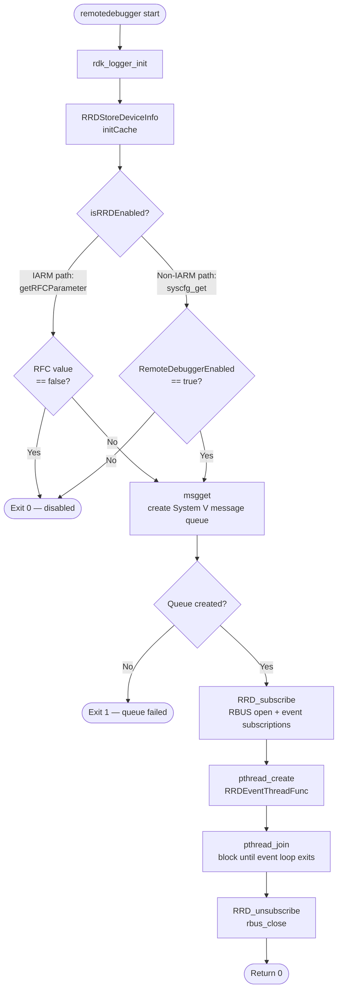
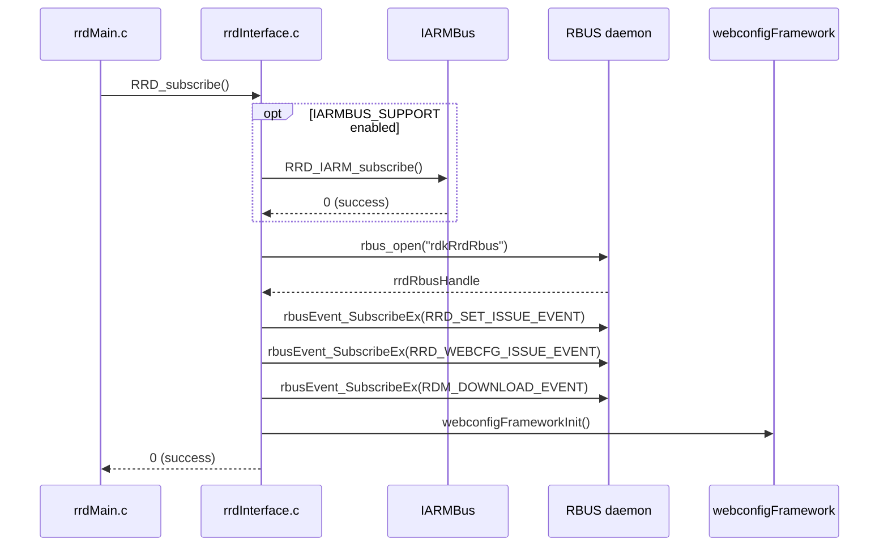
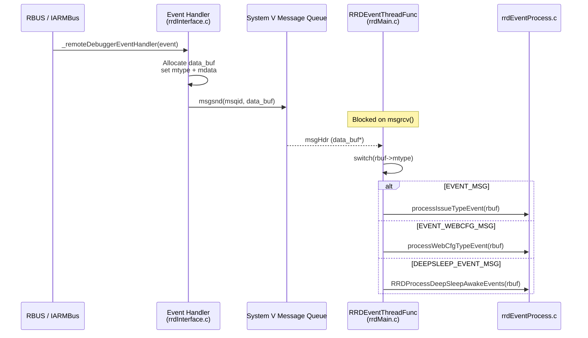
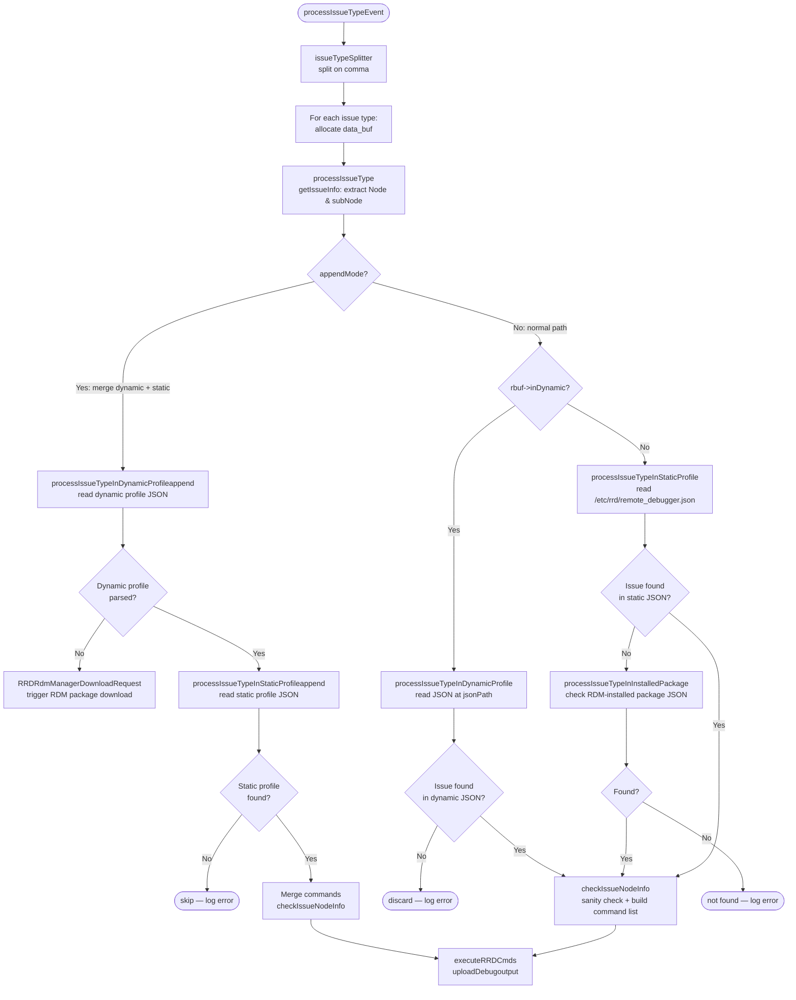
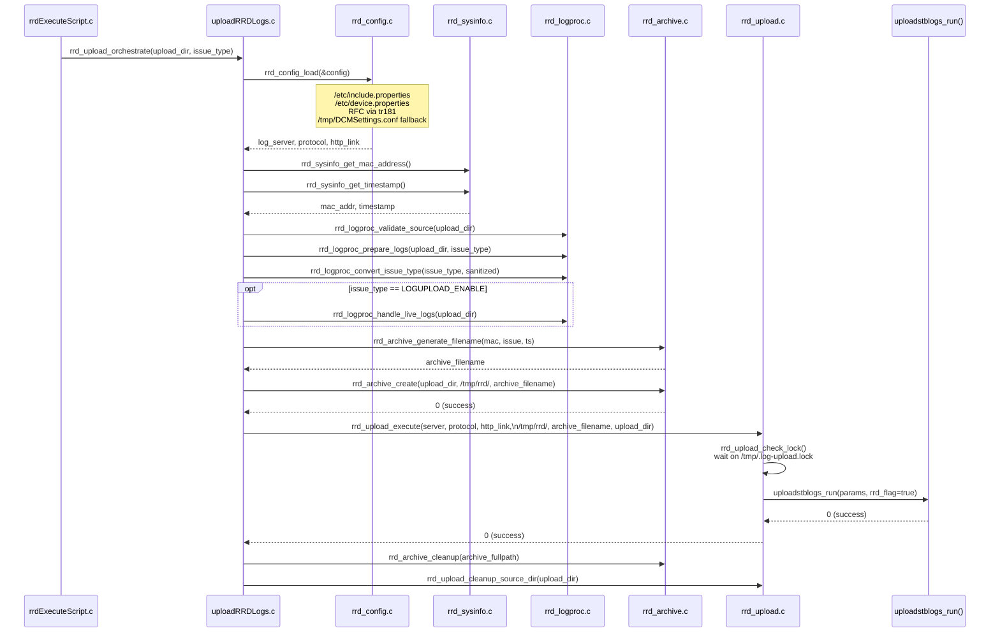

# RDK Remote Debugger

Remote Debugger is an embedded diagnostic collection module for RDK platforms. It allows the device to generate issue-specific debug reports without interactive shell access, using RFC and event-driven triggers, static or dynamic profiles, and an upload pipeline that hands off archives to the platform log-upload infrastructure.

The current implementation is a C-based daemon and support library built around the `remotedebugger` binary, optional IARMBus integration, RBUS event subscriptions, a message-queue-driven execution loop, JSON profile parsing, command safety filtering, local report generation, and archive upload orchestration.

## Table of Contents

- [Overview](#overview)
- [Current Behavior](#current-behavior)
- [Architecture](#architecture)
  - [Daemon Startup Flow](#daemon-startup-flow)
- [Module Layout](#module-layout)
- [Configuration Sources](#configuration-sources)
- [Trigger and Processing Flow](#trigger-and-processing-flow)
  - [RBUS Subscription Sequence](#rbus-subscription-sequence)
  - [Event Dispatch Sequence](#event-dispatch-sequence)
- [Profiles](#profiles)
  - [Profile Resolution Flow](#profile-resolution-flow)
- [Upload Flow](#upload-flow)
  - [Upload Pipeline Sequence](#upload-pipeline-sequence)
- [Build and Test](#build-and-test)
- [Runtime Artifacts](#runtime-artifacts)
- [RFC and Event Interfaces](#rfc-and-event-interfaces)
- [Versioning](#versioning)
- [Changelog](#changelog)

## Overview

The module is intended for field triage and remote diagnostics. A controller enables the feature, sets an issue type, and the device collects matching diagnostics into a report archive for upload.

Compared with the older script-heavy design, the current codebase has migrated key responsibilities into C modules:

- Daemon lifecycle and event loop in `src/rrdMain.c`
- RBUS and optional IARM subscription logic in `src/rrdInterface.c`
- Static and dynamic profile handling in `src/rrdJsonParser.c`, `src/rrdDynamic.c`, and `src/rrdEventProcess.c`
- Upload orchestration in `src/uploadRRDLogs.c`
- Upload execution and lock coordination in `src/rrd_upload.c`
- Configuration loading and compatibility fallbacks in `src/rrd_config.c`

## Current Behavior

At runtime, the daemon follows this high-level flow:

1. Initialize logging, device information, and internal cache.
2. Check whether Remote Debugger is enabled through RFC or syscfg-backed state.
3. Create the internal message queue.
4. Subscribe to event sources through RBUS and, when enabled, IARMBus.
5. Wait for issue, webconfig, or deep-sleep-related events.
6. Resolve the issue type against the static profile or dynamic profile path.
7. Execute allowed commands and store output under the report working directory.
8. Archive the collected output.
9. Upload the archive through the existing platform log-upload implementation.
10. Clean up generated artifacts after success or failure paths.

The daemon exits early when the feature is disabled.

## Architecture

### Control Plane

The control plane is event-driven:

- RFC or syscfg state gates whether the daemon should run.
- RBUS subscriptions receive Remote Debugger issue events and webconfig updates.
- Optional IARMBus support extends integration for platforms that use those interfaces.
- Events are converted into internal messages and processed on the daemon thread through a System V message queue.

### Data Plane

The data plane turns an issue trigger into an uploaded archive:

- Static profile data comes from `remote_debugger.json`.
- Dynamic profile processing is handled through the dynamic profile and download-manager integration paths.
- Commands are sanitized before execution.
- Command output is collected into a working directory.
- The working directory is archived under `/tmp/rrd/`.
- The archive is uploaded using the `uploadstblogs_run()` API path when IARMBus support is enabled, or by the shell fallback path otherwise.

### Visual References

Existing design diagrams are still available:

- `images/rrd_usecase.png`
- `images/rrd_architecture.png`
- `images/rrd_daemon_logic.png`
- `images/rrd_sequence.png`
- `images/rrd_sequence_flow.png`

### Daemon Startup Flow


```mermaid
flowchart TD
    A([remotedebugger start]) --> B[rdk_logger_init]
    B --> C[RRDStoreDeviceInfo\ninitCache]
    C --> D{isRRDEnabled?}
    D -->|IARM path:\ngetRFCParameter| E{RFC value\n== false?}
    D -->|Non-IARM path:\nsyscfg_get| F{RemoteDebuggerEnabled\n== true?}
    E -->|Yes| X([Exit 0 — disabled])
    E -->|No| G[msgget\ncreate System V message queue]
    F -->|No| X
    F -->|Yes| G
    G --> H{Queue created?}
    H -->|No| Y([Exit 1 — queue failed])
    H -->|Yes| I[RRD_subscribe\nRBUS open + event subscriptions]
    I --> J[pthread_create\nRRDEventThreadFunc]
    J --> K[pthread_join\nblock until event loop exits]
    K --> L[RRD_unsubscribe\nrbus_close]
    L --> M([Return 0])
```

## Module Layout

### Main executable

- `src/rrdMain.c`: daemon startup, RFC gate check, message queue creation, event thread lifecycle

### Event and interface layer

- `src/rrdInterface.c`: RBUS open, event subscription, webconfig integration, message delivery
- `src/rrdIarmEvents.c`: optional IARMBus event support
- `src/rrdRbus.h`: RBUS-facing definitions and subscription state

### Profile and event processing

- `src/rrdJsonParser.c`: static profile parsing
- `src/rrdDynamic.c`: dynamic profile and download-manager related handling
- `src/rrdEventProcess.c`: issue event processing
- `src/rrdMsgPackDecoder.c`: webconfig payload decoding support

### Command execution and safety

- `src/rrdRunCmdThread.c`: command execution flow
- `src/rrdCommandSanity.c`: command allow and block checks
- `src/rrdExecuteScript.c`: upload invocation path and script fallback handling

### Upload and report generation

- `src/uploadRRDLogs.c`: top-level archive and upload orchestration
- `src/rrd_upload.c`: upload execution, lock waiting, cleanup behavior
- `src/rrd_archive.c`: archive creation and cleanup
- `src/rrd_logproc.c`: log validation, normalization, and preprocessing
- `src/rrd_sysinfo.c`: MAC address and timestamp generation

### Configuration

- `src/rrd_config.c`: property parsing, RFC query, legacy compatibility parsing, fallback loading
- `remote_debugger.json`: packaged static profile example

### Unit and functional tests

- `src/unittest/rrdUnitTestRunner.cpp`: unit coverage for core modules
- `test/functional-tests/`: L2 test features and Python test cases
- `run_ut.sh`: unit-test entry point
- `run_l2.sh`: L2 functional test entry point

## Configuration Sources

The current implementation reads configuration from multiple places and uses fallback logic in `src/rrd_config.c`.

Primary sources:

- `/etc/include.properties`
- `/etc/device.properties`
- RFC values queried through `tr181`

Compatibility and fallback sources:

- `/tmp/DCMSettings.conf`
- `/opt/dcm.properties`
- `/etc/dcm.properties`

Important notes:

- The legacy DCM-named files are still compatibility inputs for the Remote Debugger upload configuration path.
- RFC values are preferred when available.
- If required upload values are still empty, the code falls back to `dcm.properties` locations.
- The default upload protocol is initialized to `HTTP`.

## Trigger and Processing Flow

### Enablement

The daemon checks whether Remote Debugger is enabled before entering the event loop.

Depending on build configuration and platform support, this comes from:

- RFC lookup via `getRFCParameter()` when IARMBus support is enabled
- `syscfg_get("RemoteDebuggerEnabled", ...)` when running in the non-IARM path

### Event subscriptions

The module subscribes to these event classes in the interface layer:

- Issue-type events for report generation
- Webconfig-related events
- Download-manager events for dynamic profile handling

### Internal processing

Once an event arrives:

1. The event handler converts it into an internal `data_buf` message.
2. The daemon thread receives it from the message queue.
3. The message type determines whether the request is a standard issue event, webconfig event, or deep-sleep event.
4. The processing layer resolves the issue type and executes the appropriate collection flow.

### RBUS Subscription Sequence


```mermaid
sequenceDiagram
    participant Main as rrdMain.c
    participant Iface as rrdInterface.c
    participant IARM as IARMBus
    participant RBUS as RBUS daemon
    participant WCfg as webconfigFramework

    Main->>Iface: RRD_subscribe()
    opt IARMBUS_SUPPORT enabled
        Iface->>IARM: RRD_IARM_subscribe()
        IARM-->>Iface: 0 (success)
    end
    Iface->>RBUS: rbus_open("rdkRrdRbus")
    RBUS-->>Iface: rrdRbusHandle
    Iface->>RBUS: rbusEvent_SubscribeEx(RRD_SET_ISSUE_EVENT)
    Iface->>RBUS: rbusEvent_SubscribeEx(RRD_WEBCFG_ISSUE_EVENT)
    Iface->>RBUS: rbusEvent_SubscribeEx(RDM_DOWNLOAD_EVENT)
    Iface->>WCfg: webconfigFrameworkInit()
    Iface-->>Main: 0 (success)
```

### Event Dispatch Sequence


```mermaid
sequenceDiagram
    participant RBUS as RBUS / IARMBus
    participant Handler as Event Handler<br/>(rrdInterface.c)
    participant Queue as System V Message Queue
    participant Thread as RRDEventThreadFunc<br/>(rrdMain.c)
    participant Proc as rrdEventProcess.c

    RBUS->>Handler: _remoteDebuggerEventHandler(event)
    Handler->>Handler: Allocate data_buf<br/>set mtype + mdata
    Handler->>Queue: msgsnd(msqid, data_buf)
    Note over Thread: Blocked on msgrcv()
    Queue-->>Thread: msgHdr (data_buf*)
    Thread->>Thread: switch(rbuf->mtype)
    alt EVENT_MSG
        Thread->>Proc: processIssueTypeEvent(rbuf)
    else EVENT_WEBCFG_MSG
        Thread->>Proc: processWebCfgTypeEvent(rbuf)
    else DEEPSLEEP_EVENT_MSG
        Thread->>Proc: RRDProcessDeepSleepAwakeEvents(rbuf)
    end
```

## Profiles

The Remote Debugger supports both static and dynamic profiles.

### Static profile

The static profile is packaged as `remote_debugger.json` and contains hierarchical issue categories, commands, and timeouts.

Examples in the current sample profile include:

- Device information and uptime collection
- Process and service status collection
- Deep-sleep-specific audio, video, and process diagnostics
- Sanity rules for dangerous commands

### Dynamic profile

If an issue type is not found in the static profile, the daemon can follow the dynamic profile path. This is tied to the remote download and event framework used by the platform.

### Command safety

Command execution is gated by sanity checks. The shipped sample profile includes blocked patterns such as:

- `rm -rf`
- `kill`
- `pkill`
- `iptables`
- `ip6tables`

### Profile Resolution Flow


```mermaid
flowchart TD
    A([processIssueTypeEvent]) --> B[issueTypeSplitter\nsplit on comma]
    B --> C[For each issue type:\nallocate data_buf]
    C --> D[processIssueType\ngetIssueInfo: extract Node & subNode]
    D --> E{appendMode?}

    E -->|Yes: merge dynamic + static| G[processIssueTypeInDynamicProfileappend\nread dynamic profile JSON]
    G --> H{Dynamic profile\nparsed?}
    H -->|No| I[RRDRdmManagerDownloadRequest\ntrigger RDM package download]
    H -->|Yes| J[processIssueTypeInStaticProfileappend\nread static profile JSON]
    J --> K{Static profile\nfound?}
    K -->|No| L([skip — log error])
    K -->|Yes| M[Merge commands\ncheckIssueNodeInfo]
    M --> Z[executeRRDCmds\nuploadDebugoutput]

    E -->|No: normal path| N{rbuf->inDynamic?}
    N -->|Yes| O[processIssueTypeInDynamicProfile\nread JSON at jsonPath]
    O --> P{Issue found\nin dynamic JSON?}
    P -->|No| Q([discard — log error])
    P -->|Yes| R[checkIssueNodeInfo\nsanity check + build command list]
    N -->|No| S[processIssueTypeInStaticProfile\nread /etc/rrd/remote_debugger.json]
    S --> T{Issue found\nin static JSON?}
    T -->|No| U[processIssueTypeInInstalledPackage\ncheck RDM-installed package JSON]
    U --> V{Found?}
    V -->|No| W([not found — log error])
    V -->|Yes| R
    T -->|Yes| R
    R --> Z
```

## Upload Flow

The code path for upload is now explicit and modular.

1. `rrd_upload_orchestrate()` validates inputs.
2. `rrd_config_load()` resolves upload configuration.
3. `rrd_sysinfo_get_mac_address()` and `rrd_sysinfo_get_timestamp()` build archive naming inputs.
4. `rrd_logproc_*()` validates and prepares the report contents.
5. `rrd_archive_generate_filename()` generates the archive name.
6. `rrd_archive_create()` writes the archive under `/tmp/rrd/`.
7. `rrd_upload_execute()` checks for upload lock conflicts and invokes the platform upload implementation.
8. Cleanup runs for both the archive and source directory.

Important implementation details:

- Upload lock coordination uses `/tmp/.log-upload.lock`.
- The upload implementation calls `uploadstblogs_run()` with `rrd_flag = true` in the IARM-enabled path.
- `LOGUPLOAD_ENABLE` receives special live-log handling before archiving.
- When IARMBus support is not enabled, `rrdExecuteScript.c` falls back to `/lib/rdk/uploadRRDLogs.sh`.

### Upload Pipeline Sequence


```mermaid
sequenceDiagram
    participant Script as rrdExecuteScript.c
    participant Orch as uploadRRDLogs.c
    participant Cfg as rrd_config.c
    participant Sys as rrd_sysinfo.c
    participant Log as rrd_logproc.c
    participant Arc as rrd_archive.c
    participant Up as rrd_upload.c
    participant STB as uploadstblogs_run()

    Script->>Orch: rrd_upload_orchestrate(upload_dir, issue_type)
    Orch->>Cfg: rrd_config_load(&config)
    Note over Cfg: /etc/include.properties<br/>/etc/device.properties<br/>RFC via tr181<br/>/tmp/DCMSettings.conf fallback
    Cfg-->>Orch: log_server, protocol, http_link
    Orch->>Sys: rrd_sysinfo_get_mac_address()
    Orch->>Sys: rrd_sysinfo_get_timestamp()
    Sys-->>Orch: mac_addr, timestamp
    Orch->>Log: rrd_logproc_validate_source(upload_dir)
    Orch->>Log: rrd_logproc_prepare_logs(upload_dir, issue_type)
    Orch->>Log: rrd_logproc_convert_issue_type(issue_type, sanitized)
    opt issue_type == LOGUPLOAD_ENABLE
        Orch->>Log: rrd_logproc_handle_live_logs(upload_dir)
    end
    Orch->>Arc: rrd_archive_generate_filename(mac, issue, ts)
    Arc-->>Orch: archive_filename
    Orch->>Arc: rrd_archive_create(upload_dir, /tmp/rrd/, archive_filename)
    Arc-->>Orch: 0 (success)
    Orch->>Up: rrd_upload_execute(server, protocol, http_link,\n/tmp/rrd/, archive_filename, upload_dir)
    Up->>Up: rrd_upload_check_lock()<br/>wait on /tmp/.log-upload.lock
    Up->>STB: uploadstblogs_run(params, rrd_flag=true)
    STB-->>Up: 0 (success)
    Up-->>Orch: 0 (success)
    Orch->>Arc: rrd_archive_cleanup(archive_fullpath)
    Orch->>Up: rrd_upload_cleanup_source_dir(upload_dir)
```

## Build and Test

### Build output

The top-level autotools build generates:

- Binary: `remotedebugger`
- Installed public headers under `$(includedir)/rrd`

### Main source set

The base build includes:

- `rrdMain.c`
- `rrdEventProcess.c`
- `rrdJsonParser.c`
- `rrdRunCmdThread.c`
- `rrdCommandSanity.c`
- `rrdDynamic.c`
- `rrdExecuteScript.c`
- `rrdMsgPackDecoder.c`
- `rrdInterface.c`

When `--enable-iarmbusSupport=yes` is enabled, the build also includes:

- `rrdIarmEvents.c`
- `uploadRRDLogs.c`
- `rrd_config.c`
- `rrd_sysinfo.c`
- `rrd_logproc.c`
- `rrd_archive.c`
- `rrd_upload.c`

### Configure options

The repo currently exposes these relevant options in `configure.ac`:

- `--enable-iarmbusSupport=yes|no`
- `--enable-gtestapp=yes|no`
- `--enable-L2support=yes|no`

### Standard build helper

The current helper script is:

```sh
sh cov_build.sh
```

This script prepares dependent repositories and builds the module with IARMBus support. It also builds and installs dependencies used by the Remote Debugger test and upload paths, including the external upload implementation dependency.

### Unit tests

Run unit tests with:

```sh
sh run_ut.sh
```

This script:

- enters `src/unittest/`
- regenerates autotools files
- builds `remotedebugger_gtest`
- executes the unit-test binary
- optionally captures coverage data when run with `--enable-cov`

### L2 functional tests

Run functional tests with:

```sh
sh run_l2.sh
```

The current L2 harness:

- prepares `/etc/rrd`, `/tmp/rrd`, and `/lib/rdk`
- copies `remote_debugger.json` and `uploadRRDLogs.sh`
- installs test shims for `systemd-run`, `systemctl`, and `journalctl`
- runs pytest-based functional scenarios for static profile, dynamic profile, single-instance, start control, upload, deep-sleep, harmful command, and C API upload flows
- writes JSON reports under `/tmp/l2_test_report`

## Runtime Artifacts

Common runtime paths used by the module include:

- Static profile location: `/etc/rrd/remote_debugger.json`
- Working report directory: `/tmp/rrd/`
- Upload helper script: `/lib/rdk/uploadRRDLogs.sh`
- Upload lock file: `/tmp/.log-upload.lock`
- Example source log path: `/opt/logs`

## RFC and Event Interfaces

The current README-level contract for the feature is:

- Enable Remote Debugger
- Set an issue type for collection
- Allow the daemon to resolve commands and generate an archive
- Upload the archive through the log-upload stack

Historically documented RFC parameters remain part of the feature model:

- `DeviceInfo.X_RDKCENTRAL-COM_RFC.Feature.RDKRemoteDebugger.Enable`
- `DeviceInfo.X_RDKCENTRAL-COM_RFC.Feature.RDKRemoteDebugger.IssueType`

The implementation also uses RBUS event subscriptions and webconfig integration to receive and process runtime updates.

## Versioning

Given a version number `MAJOR.MINOR.PATCH`, increment the:

- `MAJOR` version when you make incompatible API changes that break backwards compatibility.
- `MINOR` version when you add backward compatible functionality.
- `PATCH` version when you make backwards compatible bug fixes.

## Changelog

Update `CHANGELOG.md` whenever the version changes and place the newest entry at the top.

Use the following change labels:

- `Added`
- `Changed`
- `Deprecated`
- `Removed`
- `Fixed`
- `Security`
