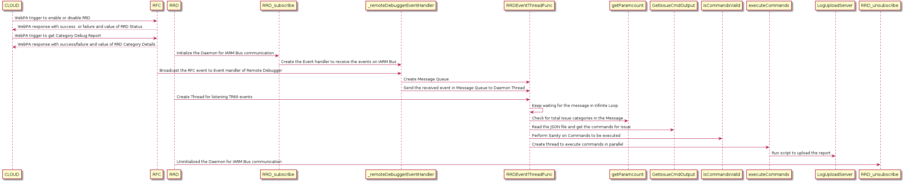

# **RDK Remote Debugger (RRD)**
## **Field Diagnostic/Debug Data Collection Tools for X-Class devices**

## Table of Contents 
[Requirement](#requirement) 
[Approach](#approach) 
[Prerequisites](#prerequisites) 
[Usecase](#usecase) 
[Implementation](#implementation) 
[Architecture Overview](#architecture-overview) 
[Sequence Diagram](#sequence-diagram) 
[RFC Parameter](#rfc-parameters) 
[Versioning](#versioning) 
[CHANGELOG](#changelog) 

### **Requirement**

As a Field Triage Engineer and Developer responsible for debugging field issues, having the ability to collect diagnostic/ debug data from the device without requiring SSH access would be beneficial. The Triage Engineer can use WebPA communication to initiate the data reporting process and retrieve the report from the S3 log service.

- A Trigger based Data Reporting
  - A WebPA based trigger
  - Ability to generate a profile-based report
  - Profile comprises of single/ multiple commands

As a Product Owner, the goal is for the device to process cloud requests internally upon receiving an external trigger and generate a report based on the issue type. The final report will be uploaded to the same log server for analysis and debugging. An additional RDK module, the RDK Remote Debugger, has been added to handle cloud request processing and report generation.

The Debugger process will run with a static profile. This profile will be created based on triage inputs, with issue types and the corresponding debug commands.

The following steps outline the process to generate the report:

1. **Initiate WebPA:** Initiate the WebPA Trigger to start Report generation from Cloud Server endpoint.

2. **Enable Remote Debugger:** Enable Remote Debugger on the device by setting below tr181 data  model

    `DeviceInfo.X_RDKCENTRAL-COM_RFC.Feature.RDKRemoteDebugger.Enable`

3. **Set Issue Type:** The WebPA command will set the issue types for report generation. Using the new tr181 data model.

    `DeviceInfo.X_RDKCENTRAL-COM_RFC.Feature.RDKRemoteDebugger.IssueType`

4. **RRD Daemon Startup:** The RRD daemon will start on Boot up and will subscribe for WebPA event for handling the Cloud requests.

5. **Event Handling:** Upon receiving an event trigger, the handler will look up the issue type in static profile and will collect the corresponding debug commands for execution.

6. **Dynamic Profile Handling**: If the specific issue type is not found in the Static profile, the RRD will trigger a download for a Dynamic profile via the RDK Download Manager. The following outcomes are possible:
   - If the download succeeds and the profile contains the issue type, the corresponding debug command will be executed.
   - If the Dynamic profile is not available or if the profile is available but the download fails,  it will be logged.

### **Approach:**

The RDK Remote Debugger is an application that collects debug and diagnostic information from RDK platforms without the need for SSH access to the device. It operates as a daemon with an IARM Event handler, which listens for events from the TR181 RFC parameters via IARM Bus communication. These events are received from the WebPA and processed by the Remote Debugger Main Thread, using a message queue to manage different types of messages. Based on the issue type, the corresponding debug commands are extracted from a JSON file and executed through system calls. The resulting output is generated as a report, which is then uploaded to an S3 server.

### **Prerequisites:**

The RDK Remote Debugger Daemon relies on the RFC and WebPA mechanisms to communicate with the requester for data collection.

- The RFC parameter is used to send events through WebPA.
- The Remote Debugger runs with a default profile.
- The profile includes issue categories and a set of corresponding commands.
- Based on the value of the RFC parameter, the relevant commands are read and executed.
- If the issue type is not found in the default profile, the system will attempt to download a dynamic profile via the Download Manager.

#### **RRD Features with Static Profile**

- Collect diagnostic and debug data from field devices without the need for SSH access.
- Use existing communication channels, such as WebPA, to trigger report generation based on the static profile.
- Start the Debugger with the default profile, which is packaged during build time.

#### **RRD Features with Dynamic Profile**

- Collect diagnostic and debug data from field devices without requiring SSH access.
- Trigger report generation via existing communication channels, such as WebPA, based on the dynamic profile.
- If the issue type is not found in the static profile, automatically download the dynamic profile via the Download Manager.
- Execute commands from the dynamic profile if available, with the ability to handle failures in downloading or missing issue types.

### **Usecase**

### **Implementation:**

The Remote Debugger reads the IARM event and the value from the TR69 parameter, passing the message to the thread via a message queue. The daemon receives the message from IARM and reads the [remote_debugger.json](./remote_debugger.json) file to capture the commands associated with the issue type. System calls are used to execute these commands.

- WebPA is used from the remote side:
    - Triggers the start and initiation of command execution via RRD.
    - Initiates the RDM process for dynamic profile updates.
- RRD processes the request based on the issue type:
    - Uses the TR181 data model for each issue type/category.
    - The handler looks up the profile database for the corresponding debug commands.
    - Generates the final report.
    - Uploads the final report tar file to the S3 log server.

### **Architecture Overview**

### **Sequence Diagram**

### **RFC Parameters:**

Implemented the following RFC parameters as part of the Remote Debugger feature. These parameters enable or disable the RRD feature and trigger events for the required issue types. All relevant information is updated in the tr69hostif source code (datamodel.xml) and the Device_DeviceInfo source code to create the set functions that broadcast the event using IARM calls.

- `DeviceInfo.X_RDKCENTRAL-COM_RFC.Feature.RDKRemoteDebugger.Enable` - This parameter is a Boolean value (True/False) used to control the activation or deactivation of the RRD feature.
- `DeviceInfo.X_RDKCENTRAL-COM_RFC.Feature.RDKRemoteDebugger.IssueType` - This parameter takes a string value that sets the data through RFC to trigger the event for the Daemon, based on the specified issue type.

### Versioning
Given a version number MAJOR.MINOR.PATCH, increment the:
- **MAJOR:** version when you make incompatible API changes that break backwards compatibility. This could be removing existing APIs, changes to API Signature or major changes to API behavior that breaks API contract, 
- **MINOR:** version when you add backward compatible new features like adding new APIs, adding new parameters to existing APIs,
- **PATCH:** version when you make backwards compatible bug fixes.

### CHANGELOG
The CHANGELOG file that contains all changes done so far. When version is updated, add a entry in the CHANGELOG.md at the top with user friendly information on what was changed with the new version. Refer to [Changelog](https://github.com/olivierlacan/keep-a-changelog/blob/main/CHANGELOG.md) as an example and [Keep a Changelog](https://keepachangelog.com/en/1.0.0/) for more details.

Please Add entry in the CHANGELOG for each version change and indicate the type of change with these labels:
- **Added** for new features.
- **Changed** for changes in existing functionality.
- **Deprecated** for soon-to-be removed features.
- **Removed** for now removed features.
- **Fixed** for any bug fixes.
- **Security** in case of vulnerabilities.
