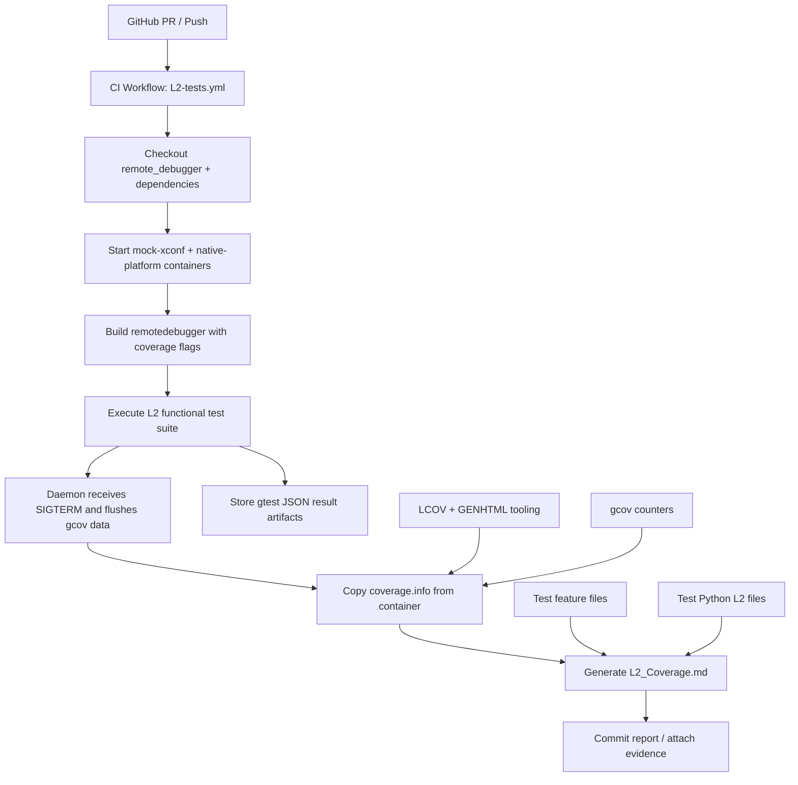

# Remote Debugger L2 Function Coverage - High-Level Design

## Document Information
- **Component Name:** Remote Debugger L2 Functional Coverage Automation
- **Related PR:** #216
- **Version:** 1.0
- **Date:** September 21, 2026
- **Primary Scope:** Coverage collection for L2 functional tests, trace-file generation, and report synthesis for feature-to-test gap analysis
- **Target Environment:** Linux CI container and embedded-device test harness used by the Remote Debugger project

## 1. Executive Summary

This document describes the high-level design introduced by PR #216 for L2 functional coverage documentation in the Remote Debugger project. The change adds a reproducible path to build the daemon with coverage instrumentation, execute the L2 suite in a containerized environment, collect `gcov`/`lcov` data, and generate a Markdown coverage report that maps feature files to test cases and highlights coverage gaps.

The design supports the following objectives:

- Generate reliable coverage data for `remotedebugger` while L2 tests are executing.
- Ensure coverage counters are flushed on daemon termination so data is not lost.
- Reuse the existing functional-test framework without changing test behavior.
- Publish a human-readable L2 coverage summary that tracks which behaviors are covered and which remain untested.
- Provide a gap-analysis artifact that connects BDD feature files and Python L2 tests for future expansion.

This is a documentation and automation design rather than a new runtime feature for the daemon itself. It improves observability, traceability, and quality gate health for the functional test suite.

## 2. Goals and Scope

### 2.1 Goals

1. Enable coverage instrumentation for the L2 journey without impacting the core daemon logic.
2. Execute L2 tests in a CI-like container environment with a deterministic build path.
3. Collect `coverage.info` from the native-platform test container after the suite completes.
4. Parse test metadata and feature metadata to compute function-level and feature-level coverage signals.
5. Publish a generated Markdown report under the test-functional directory for review in PRs and CI.
6. Support incremental test improvement by identifying orphan features, orphan tests, and unmapped scenarios.

### 2.2 Non-Goals

- Replacing the existing functional-test suite or altering product behavior.
- Measuring unit-test coverage in the same workflow as L2 coverage.
- Enforcing a single mandatory coverage threshold across all product areas.
- Modifying business logic in the daemon for testability reasons alone.

## 3. Architecture Overview

### 3.1 System Context



### 3.2 High-Level Components

The design is built around four primary components:

1. **Coverage-enabled build path**
   - Rebuilds the daemon with `-DUSECOV` and the relevant `gcov` linker flags.
   - Uses the existing `cov_build.sh` workflow and `run_l2.sh` execution path.

2. **Runtime coverage flush**
   - Installs a signal handler in `rrdMain.c` for `SIGTERM`.
   - Calls `__gcov_dump()` before exiting so counters are written before the process terminates.

3. **L2 execution and collection pipeline**
   - Runs the functional tests in the native-platform container.
   - Copies `coverage.info` back to the runner after test completion.
   - Publishes test result artifacts for CI visibility.

4. **Coverage report synthesis**
   - Maps `*.feature` files to `*.py` L2 tests.
   - Parses `coverage.info` and correlates execution results with expected scenarios.
   - Outputs a Markdown report documenting direct coverage, indirect coverage, gap analysis, and next actions.

## 4. Design Principles

- **Low intrusion:** The production logic is not changed beyond necessary instrumentation and signal handling.
- **Deterministic automation:** The report is generated in CI from the same build and test inputs each run.
- **Evidence-driven quality tracking:** The generated report serves as a living artifact rather than an isolated static document.
- **Traceability:** Feature files, L2 test files, and coverage data are linked in a single repository artifact.
- **Portability:** The approach relies on standard `gcov`/`lcov` tooling and containerized execution; it fits the project’s embedded Linux environment.

## 5. Detailed Module Breakdown

### 5.1 Coverage-enabled Build Configuration

**Module:** `cov_build.sh`, `run_l2.sh`, `Makefile.am`

**Purpose:** Build the project with coverage instrumentation enabled when the L2 suite is executed.

**Responsibilities:**
- Add `-DUSECOV` to the compile-time flags.
- Link coverage libraries required by `gcov`.
- Create a local build path for functional test execution.
- Ensure the generated binary emits profile data in the expected directory layout.

**Key design behavior:**
- Coverage is not enabled by default for every production build.
- The L2 flow specifically builds the daemon in the test container in a coverage mode so the report is meaningful and reproducible.

**Dependencies:**
- GNU make
- `gcc`/`gcov`
- `lcov`
- project source tree and mock dependencies

### 5.2 Runtime Signal Handling for Coverage Flush

**Module:** `src/rrdMain.c`

**Purpose:** Guarantee that `gcov` counters are flushed before the remote-debugger daemon exits under normal test shutdown.

**Key implementation detail:**

```c
#ifdef USECOV
#include <signal.h>
#include <stdlib.h>
extern void __gcov_dump(void);

static void rrd_gcov_sigterm_handler(int sig)
{
    (void)sig;
    __gcov_dump();
    _exit(0);
}
#endif
```

**Responsibilities:**
- Install `SIGTERM` handling when `USECOV` is enabled.
- Call `__gcov_dump()` to write the counter data.
- Exit immediately without leaving data pending in the runtime buffer.

**Why this matters:**
The L2 suite terminates the daemon by signal during teardown in coverage mode. Without explicit flush, coverage traces can be incomplete or empty, which would make the L2 coverage report unreliable.

### 5.3 L2 Test Execution Pipeline

**Module:** `.github/workflows/L2-tests.yml`, `run_l2.sh`

**Purpose:** Execute the full functional suite in a consistent container environment and archive its artifacts.

**Responsibilities:**
- Start the dependent supporting services such as mock xConf.
- Check out source and dependent repositories into the container.
- Run the build and functional-test sequence.
- Push gtest JSON results to the RDK orchestration backend.
- Copy trace output back to the runner for document generation.

**Data produced:**
- `gtest` JSON result bundles
- `coverage.info`
- generated Markdown report and patchback commit if the workflow is triggered on push

### 5.4 Trace Collection and Coverage Data

**Module:** `lcov`, `coverage.info`, `genhtml`

**Purpose:** Capture and normalize the runtime coverage result into a single file used for gap analysis and reporting.

**Responsibilities:**
- Collect execution traces from compiled objects and instrumented source.
- Exclude irrelevant third-party directories when required.
- Convert the raw coverage output into a single trace file consumed by the report generator.

**Outputs:**
- `coverage.info`
- HTML coverage views in CI or local validation tooling

### 5.5 Coverage Report Generation

**Module:** `test/functional-tests/generate_l2_coverage_report.py` (as referenced by the workflow)

**Purpose:** Convert the raw coverage trace and the feature/test inventory into a human-readable summary and actionable gap analysis.

**Responsibilities:**
- Discover feature files under `test/functional-tests/features/`.
- Discover Python-based L2 tests under `test/functional-tests/tests/`.
- Map feature scenarios to corresponding tests.
- Detect orphan tests, orphan features, and partial mappings.
- Emit Markdown output such as `test/functional-tests/L2_Coverage.md`.

**Inputs:**
- `coverage.info`
- feature directory
- test directory
- source tree metadata

**Outputs:**
- Markdown report with summary metrics, tables, and scenario coverage status

## 6. Functional Workflow

### 6.1 Build Flow

1. The workflow checks out the project and its dependent repositories.
2. The container starts mock services and the native-platform test environment.
3. `cov_build.sh` is executed with the project-specific CFLAGS and LDFLAGS for coverage mode.
4. The build includes instrumentation flags so the daemon produces runtime gcov data.

### 6.2 Test Flow

1. `run_l2.sh` launches the functional test suite against the instrumented daemon.
2. The daemon receives the signal sequences used by the test harness during shutdown.
3. The daemon traps `SIGTERM` and calls `__gcov_dump()` before exiting.
4. The container persists the resulting coverage profile for later extraction.

### 6.3 Report Flow

1. The workflow copies `coverage.info` from the container to the GitHub runner.
2. The Python report generator reads the trace file plus the feature/test directory metadata.
3. A Markdown report is produced with sections like:
   - coverage overview
   - direct and indirect coverage counts
   - mapped vs unmapped features
   - orphan features and orphan tests
   - gap analysis by behavior group
4. On push-based workflow execution, the report is committed to the branch for review.

## 7. Data and Interface Model

### 7.1 Coverage Artifact

The key artifact is `coverage.info`, which is generated by `lcov` and represents the execution coverage for the instrumented binaries.

This file is the canonical input for reporting and is used to answer questions such as:
- Which functions were executed by L2 tests?
- Which features are currently covered by the active test set?
- Which scenarios remain untested or only indirectly exercised?

### 7.2 Feature-Test Inventory

The repository keeps feature definitions and Python tests in separate but related repositories of metadata:

- `test/functional-tests/features/*.feature`
- `test/functional-tests/tests/*.py`

The generator reads both and builds mappings to support consistent coverage narration.

### 7.3 Generated Report Content

The generated report documents the following:

- total source-function estimate
- functions with direct L2 coverage
- functions with indirect coverage
- functions with no L2 coverage
- active vs disabled tests
- active feature scenarios and expected gaps
- per-behavior coverage tables
- feature/test gap summary by area such as static profile handling, dynamic profile handling, upload flow, and harmful command detection

## 8. Error Handling and Boundary Conditions

### 8.1 No Coverage Trace Available

If the native container does not produce `coverage.info`, the workflow should skip the report-generation step gracefully rather than failing the entire CI run. This preserves the test execution itself while keeping the report optional when the instrumentation path is unavailable.

### 8.2 Daemon Shutdown Before Coverage Flush

If the daemon exits without normal signal handling, counters may be incomplete. The `SIGTERM` handler mitigates this risk and provides deterministic flush behavior in coverage builds.

### 8.3 Missing Feature/Test Mapping

If a feature file has no corresponding test file or a test file has no matching feature, the report categorizes it as a gap to be reviewed by the engineering team. This is intentional and supports continuous improvement.

### 8.4 Coverage Data Noise

The workflow may need to prune third-party directories when generating the trace to avoid distorting the metrics with dependency code. The design is compatible with `lcov --remove` filtering during report generation.

## 9. Benefits

- Improves the quality and trustworthiness of L2 functional validation.
- Makes test coverage trends visible in PRs and CI artifacts.
- Simplifies review by explaining which requested behaviors are actually covered.
- Creates a reusable template for future coverage-based documentation and regression defense.
- Reduces accidental drift between feature expectations and executable tests.

## 10. Risks and Mitigations

### 10.1 Coverage Report Drift

**Risk:** The generated Markdown report may become stale or inaccurate if the workflow is not triggered consistently.

**Mitigation:** Generate the report from CI on pushes and commit the artifact when it changes.

### 10.2 Signal Timing in Coverage Mode

**Risk:** A daemon may terminate before the coverage dump is finalized.

**Mitigation:** Explicit `SIGTERM` flush with `__gcov_dump()` and immediate exit ensures counters are captured.

### 10.3 Missing or Partial Feature Mapping

**Risk:** The coverage report may overstate coverage if a feature is loosely mapped to a test.

**Mitigation:** Keep the report explicit about direct coverage, indirect coverage, and gaps, rather than asserting full equivalence.

## 11. Testing and Validation Strategy

The design is validated through the existing L2 functional pipeline and its CI automation:

1. Build the project in coverage mode.
2. Run the L2 suite in the containerized environment.
3. Confirm `coverage.info` is generated successfully.
4. Confirm the report is generated and that the Markdown content reflects the live feature/test inventory.
5. Review the report for missing mappings and orphan scenarios.

This provides a repeatable acceptance gate for future PRs that extend or modify remotedebugger behavior.

## 12. Relationship to Existing Repository Assets

This design complements existing repository artifacts:

- `src/rrdMain.c` – runtime coverage flush during shutdown
- `cov_build.sh` – build the daemon in coverage mode
- `run_l2.sh` – execute the L2 suite
- `.github/workflows/L2-tests.yml` – orchestrate L2 execution and coverage collection
- `test/functional-tests/L2_Test_Coverage.md` – output report produced by the workflow
- `docs/uploadRRDLogs_HLD.md` and related docs – existing HLD pattern for project documentation

## 13. Summary

PR #216 establishes a structured L2 coverage mechanism for the Remote Debugger. It does not change the product behavior; instead, it creates a disciplined CI flow that measures execution coverage, preserves trace data during shutdown, and publishes a human-readable artifact that reveals the feature-to-test map and remaining gaps.

This design is valuable because it turns quality validation from a loose activity into a traceable engineering workflow that can be reviewed, improved, and extended over time.
