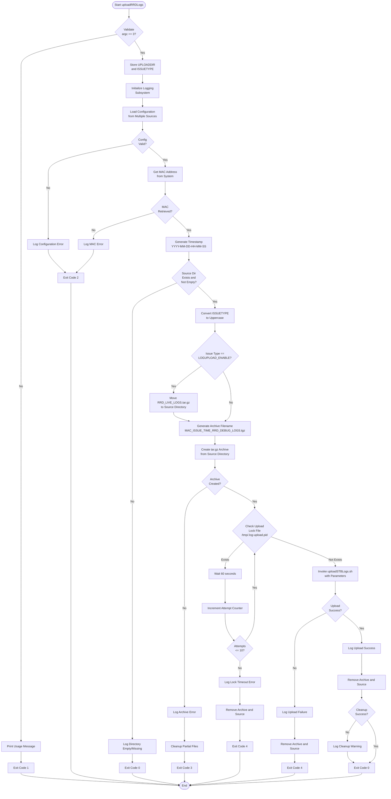
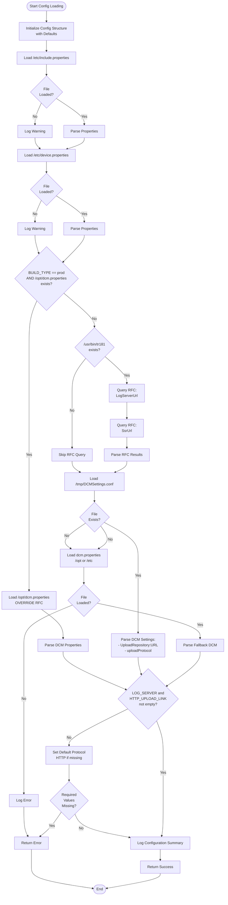
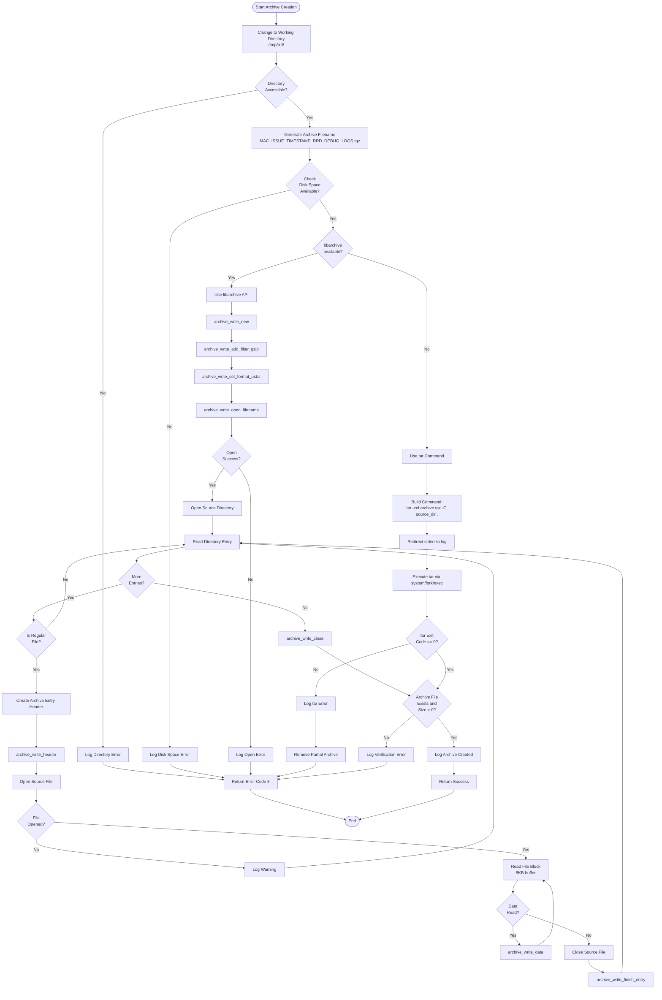
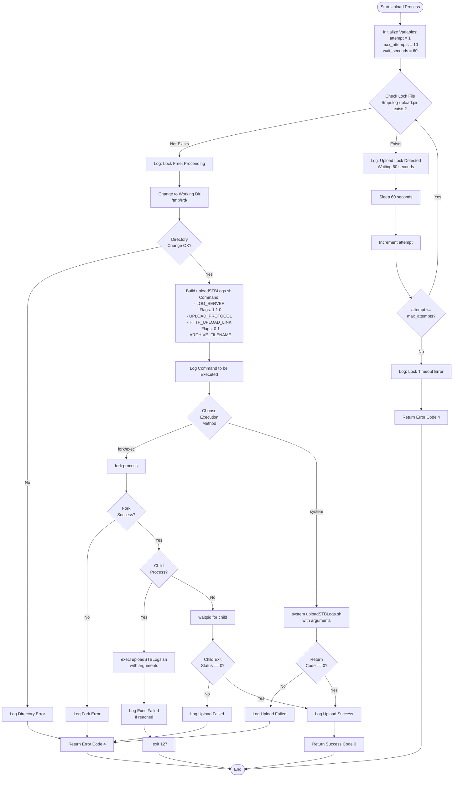
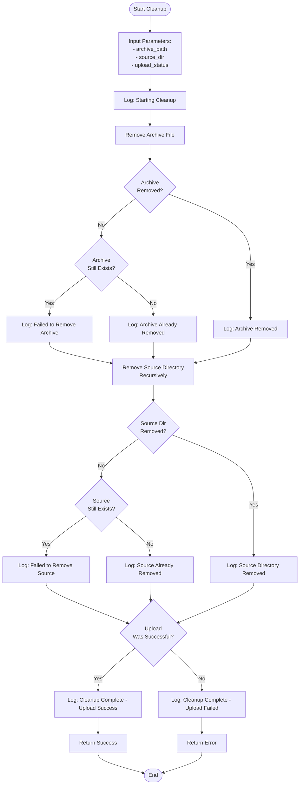
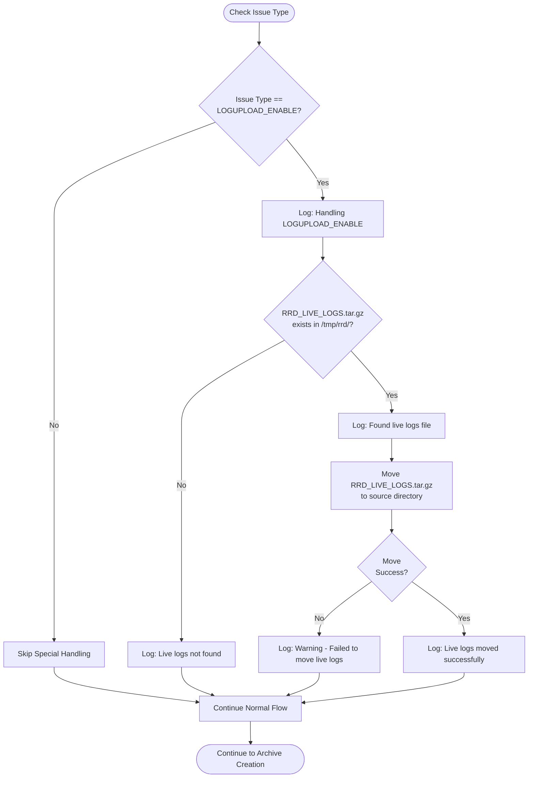
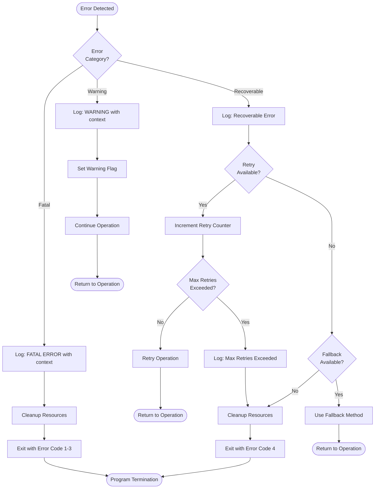

# uploadRRDLogs - Flowchart Documentation

## Document Information
- **Component Name:** uploadRRDLogs (C Implementation)
- **Version:** 1.0
- **Date:** December 1, 2025

## 1. Main Program Flowchart

### 1.1 Overall Program Flow (Mermaid)



### 1.2 Simplified Text-Based Main Flow

```
START
  |
  v
[Validate Command-Line Arguments]
  |
  ├─> (Invalid) --> [Print Usage] --> EXIT(1)
  |
  v (Valid)
[Initialize Logging]
  |
  v
[Load Configuration]
  |
  ├─> (Failed) --> [Log Error] --> EXIT(2)
  |
  v (Success)
[Get System Information (MAC, Timestamp)]
  |
  ├─> (Failed) --> [Log Error] --> EXIT(2)
  |
  v (Success)
[Validate Source Directory]
  |
  ├─> (Empty/Missing) --> [Log Message] --> EXIT(0)
  |
  v (Valid)
[Process Issue Type (Uppercase, Special Handling)]
  |
  v
[Generate Archive Filename]
  |
  v
[Create tar.gz Archive]
  |
  ├─> (Failed) --> [Cleanup] --> EXIT(3)
  |
  v (Success)
[Check and Wait for Upload Lock]
  |
  ├─> (Timeout) --> [Cleanup] --> EXIT(4)
  |
  v (Lock Free)
[Execute Upload Script]
  |
  ├─> (Failed) --> [Cleanup] --> EXIT(4)
  |
  v (Success)
[Cleanup Archive and Source]
  |
  v
EXIT(0)
  |
  v
END
```

## 2. Configuration Loading Flowchart

### 2.1 Configuration Loading (Mermaid)



### 2.2 Text-Based Configuration Flow

```
START Configuration Loading
  |
  v
[Initialize config structure with defaults]
  |
  v
[Load /etc/include.properties]
  ├─> Parse key=value pairs
  ├─> Extract RDK_PATH, LOG_PATH, etc.
  |
  v
[Load /etc/device.properties]
  ├─> Parse key=value pairs
  ├─> Extract BUILD_TYPE, etc.
  |
  v
{Check: BUILD_TYPE == "prod" AND /opt/dcm.properties exists?}
  |
  ├─> YES: [Load /opt/dcm.properties] --> [Skip RFC] --> VALIDATE
  |
  └─> NO: Continue
      |
      v
    {Check: /usr/bin/tr181 exists?}
      |
      ├─> NO: [Skip RFC Query] --> [Load DCMSettings.conf]
      |
      └─> YES: [Query RFC Parameters]
          |
          ├─> tr181 -g Device.DeviceInfo.X_RDKCENTRAL-COM_RFC.LogUpload.LogServerUrl
          ├─> tr181 -g Device.DeviceInfo.X_RDKCENTRAL-COM_RFC.LogUpload.SsrUrl
          ├─> Store results
          |
          v
        [Load /tmp/DCMSettings.conf]
          |
          ├─> Parse: LogUploadSettings:UploadRepository:URL
          ├─> Parse: LogUploadSettings:UploadRepository:uploadProtocol
          |
          v
        {DCMSettings.conf loaded successfully?}
          |
          ├─> YES: VALIDATE
          |
          └─> NO: [Load /opt/dcm.properties or /etc/dcm.properties]
              |
              ├─> Parse properties
              |
              v
            {Fallback loaded?}
              |
              ├─> NO: RETURN ERROR
              |
              └─> YES: VALIDATE
                  |
                  v
                VALIDATE:
                  |
                  v
                {LOG_SERVER not empty?}
                  |
                  ├─> NO: RETURN ERROR
                  |
                  v
                {HTTP_UPLOAD_LINK not empty?}
                  |
                  ├─> NO: RETURN ERROR
                  |
                  v
                {UPLOAD_PROTOCOL empty?}
                  |
                  ├─> YES: Set default "HTTP"
                  |
                  v
                [Log configuration summary]
                  |
                  v
                RETURN SUCCESS
```

## 3. Archive Creation Flowchart

### 3.1 Archive Creation (Mermaid)



### 3.2 Text-Based Archive Creation Flow

```
START Archive Creation
  |
  v
[Change to working directory: /tmp/rrd/]
  |
  ├─> (Failed) --> [Log Error] --> RETURN ERROR(3)
  |
  v (Success)
[Generate archive filename from MAC, Issue Type, Timestamp]
  |
  v
[Check available disk space in /tmp]
  |
  ├─> (Insufficient) --> [Log Error] --> RETURN ERROR(3)
  |
  v (Sufficient)
{Check: libarchive available?}
  |
  ├─> YES: [Use Native C Archive Creation]
  |     |
  |     v
  |   [Initialize libarchive]
  |   [Set gzip compression]
  |   [Set tar format (ustar)]
  |   [Open output archive file]
  |     |
  |     ├─> (Open Failed) --> [Log Error] --> RETURN ERROR(3)
  |     |
  |     v (Opened)
  |   [Open source directory]
  |   FOR each file in directory:
  |     |
  |     ├─> [Create archive entry header]
  |     ├─> [Write header to archive]
  |     ├─> [Open source file]
  |     |     |
  |     |     ├─> (Failed) --> [Log Warning] --> Continue
  |     |     |
  |     |     v (Opened)
  |     |   WHILE data remaining:
  |     |     |
  |     |     ├─> [Read 8KB block from file]
  |     |     ├─> [Write block to archive]
  |     |     └─> Loop
  |     |   END WHILE
  |     |     |
  |     |     v
  |     ├─> [Close source file]
  |     ├─> [Finish archive entry]
  |     └─> Next file
  |   END FOR
  |     |
  |     v
  |   [Close archive]
  |     |
  |     v
  |   GOTO VERIFY
  |
  └─> NO: [Use tar Command Method]
        |
        v
      [Build command: tar -zcf archive.tgz -C source_dir .]
      [Redirect stderr to log file]
      [Execute tar via fork/exec or system]
        |
        v
      {tar exit code == 0?}
        |
        ├─> NO: [Log tar error] --> [Remove partial files] --> RETURN ERROR(3)
        |
        v YES
      VERIFY:
        |
        v
      [Check archive file exists]
      [Check archive file size > 0]
        |
        ├─> (Invalid) --> [Log Error] --> RETURN ERROR(3)
        |
        v (Valid)
      [Log success message]
        |
        v
      RETURN SUCCESS
        |
        v
      END
```

## 4. Upload Management Flowchart

### 4.1 Upload with Lock Management (Mermaid)



### 4.2 Text-Based Upload Flow

```
START Upload Process
  |
  v
[Initialize: attempt=1, max_attempts=10, wait_seconds=60]
  |
  v
RETRY_LOOP:
  |
  v
{Check: /tmp/.log-upload.pid exists?}
  |
  ├─> NO: [Lock is free] --> PROCEED_UPLOAD
  |
  └─> YES: [Lock is held]
      |
      v
    [Log: Another upload in progress, waiting...]
      |
      v
    [Sleep 60 seconds]
      |
      v
    [Increment attempt counter]
      |
      v
    {attempt <= 10?}
      |
      ├─> NO: [Log: Lock timeout error]
      |       |
      |       v
      |     RETURN ERROR(4)
      |
      └─> YES: GOTO RETRY_LOOP

PROCEED_UPLOAD:
  |
  v
[Change directory to /tmp/rrd/]
  |
  ├─> (Failed) --> [Log Error] --> RETURN ERROR(4)
  |
  v (Success)
[Build uploadSTBLogs.sh command with parameters:
   - $RDK_PATH/uploadSTBLogs.sh
   - LOG_SERVER
   - 1
   - 1
   - 0
   - UPLOAD_PROTOCOL
   - HTTP_UPLOAD_LINK
   - 0
   - 1
   - ARCHIVE_FILENAME]
  |
  v
[Log command being executed]
  |
  v
{Choose execution method: fork/exec or system?}
  |
  ├─> fork/exec:
  |     |
  |     v
  |   [Fork new process]
  |     |
  |     ├─> (Fork Failed) --> [Log Error] --> RETURN ERROR(4)
  |     |
  |     v (Fork Success)
  |   {Am I child process?}
  |     |
  |     ├─> YES: [execl uploadSTBLogs.sh with args]
  |     |       |
  |     |       └─> (If execl returns) [Log Error] [_exit(127)]
  |     |
  |     └─> NO: [Parent: waitpid for child]
  |           |
  |           v
  |         [Get child exit status]
  |           |
  |           v
  |         {Exit status == 0?}
  |           |
  |           ├─> NO: [Log Upload Failed] --> RETURN ERROR(4)
  |           |
  |           └─> YES: UPLOAD_SUCCESS
  |
  └─> system:
        |
        v
      [system(full_command_string)]
        |
        v
      [Get return code]
        |
        v
      {Return code == 0?}
        |
        ├─> NO: [Log Upload Failed] --> RETURN ERROR(4)
        |
        └─> YES: UPLOAD_SUCCESS

UPLOAD_SUCCESS:
  |
  v
[Log: Upload completed successfully]
  |
  v
RETURN SUCCESS(0)
  |
  v
END
```

## 5. Cleanup Operations Flowchart

### 5.1 Cleanup Process (Mermaid)



### 5.2 Text-Based Cleanup Flow

```
START Cleanup
  |
  v
INPUT: archive_path, source_dir, upload_status
  |
  v
[Log: Starting cleanup operations]
  |
  v
[Attempt to remove archive file: archive_path]
  |
  v
{Archive removed successfully?}
  |
  ├─> NO: {Archive file still exists?}
  |       |
  |       ├─> YES: [Log: WARNING - Failed to remove archive]
  |       |
  |       └─> NO: [Log: INFO - Archive not found (already removed?)]
  |
  └─> YES: [Log: INFO - Archive removed successfully]
  |
  v
[Attempt to remove source directory recursively: source_dir]
  |
  v
{Source directory removed successfully?}
  |
  ├─> NO: {Source directory still exists?}
  |       |
  |       ├─> YES: [Log: WARNING - Failed to remove source directory]
  |       |
  |       └─> NO: [Log: INFO - Source not found (already removed?)]
  |
  └─> YES: [Log: INFO - Source directory removed successfully]
  |
  v
{Was upload operation successful?}
  |
  ├─> YES: [Log: Cleanup complete - Upload succeeded]
  |         |
  |         v
  |       RETURN SUCCESS(0)
  |
  └─> NO: [Log: Cleanup complete - Upload failed]
          |
          v
        RETURN ERROR(4)
  |
  v
END
```

## 6. Special Case: LOGUPLOAD_ENABLE Flowchart

### 6.1 LOGUPLOAD_ENABLE Handling (Mermaid)



### 6.2 Text-Based LOGUPLOAD_ENABLE Flow

```
START Issue Type Processing
  |
  v
[Convert issue_type to uppercase]
  |
  v
{issue_type == "LOGUPLOAD_ENABLE"?}
  |
  ├─> NO: CONTINUE_NORMAL
  |
  └─> YES: [Handle special case]
      |
      v
    [Log: Check for live device logs]
      |
      v
    {Check: /tmp/rrd/RRD_LIVE_LOGS.tar.gz exists?}
      |
      ├─> NO: [Log: Live logs file not found]
      |       |
      |       v
      |     CONTINUE_NORMAL
      |
      └─> YES: [Log: Live logs file found]
          |
          v
        [Attempt to move RRD_LIVE_LOGS.tar.gz to source_dir]
          |
          v
        {Move successful?}
          |
          ├─> NO: [Log: WARNING - Failed to move live logs]
          |       [Log: Continuing without live logs]
          |       |
          |       v
          |     CONTINUE_NORMAL
          |
          └─> YES: [Log: Live logs included in upload]
              |
              v
            CONTINUE_NORMAL

CONTINUE_NORMAL:
  |
  v
[Proceed to archive creation]
  |
  v
END
```

## 7. Error Handling Decision Tree

### 7.1 Error Handling Flow (Mermaid)



### 7.2 Text-Based Error Handling

```
ERROR DETECTED
  |
  v
DETERMINE ERROR CATEGORY:
  |
  ├─> FATAL ERROR (Cannot Continue)
  |     |
  |     v
  |   [Log error with full context: timestamp, operation, error details]
  |     |
  |     v
  |   [Perform cleanup: close files, free memory, remove partial files]
  |     |
  |     v
  |   [Exit with appropriate code:
  |      1 = Argument error
  |      2 = Configuration error
  |      3 = Archive error]
  |     |
  |     v
  |   PROGRAM TERMINATION
  |
  ├─> RECOVERABLE ERROR (Can Retry)
  |     |
  |     v
  |   [Log error with context]
  |     |
  |     v
  |   {Retry mechanism available?}
  |     |
  |     ├─> YES: {Max retries exceeded?}
  |     |       |
  |     |       ├─> NO: [Wait/backoff] --> [Retry operation]
  |     |       |
  |     |       └─> YES: [Cleanup] --> [Exit with code 4]
  |     |
  |     └─> NO: {Fallback method available?}
  |           |
  |           ├─> YES: [Use fallback] --> CONTINUE
  |           |
  |           └─> NO: [Cleanup] --> [Exit with code 4]
  |
  └─> WARNING (Non-Critical)
        |
        v
      [Log warning message]
        |
        v
      [Set warning flag (optional)]
        |
        v
      [Continue normal operation]
        |
        v
      RETURN TO OPERATION
```

## Document Revision History

| Version | Date | Author | Changes |
|---------|------|--------|---------|
| 1.0 | December 1, 2025 | GitHub Copilot | Initial flowchart documentation |
