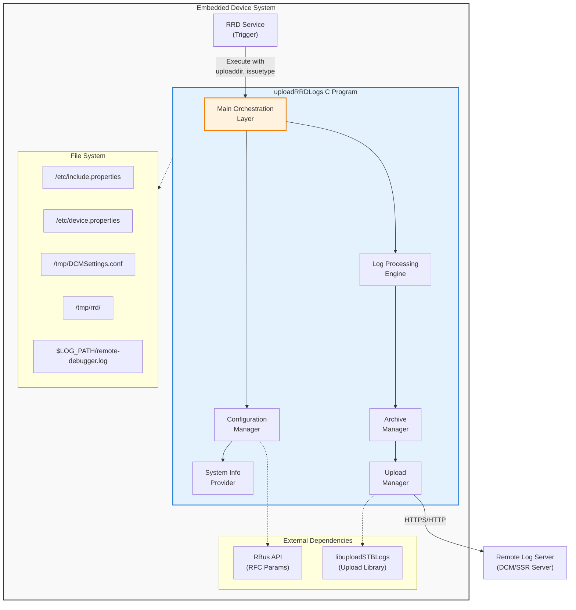
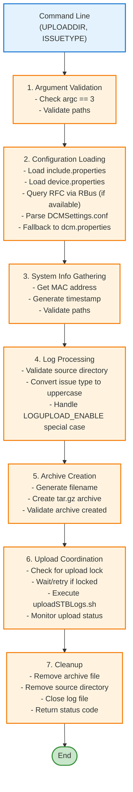
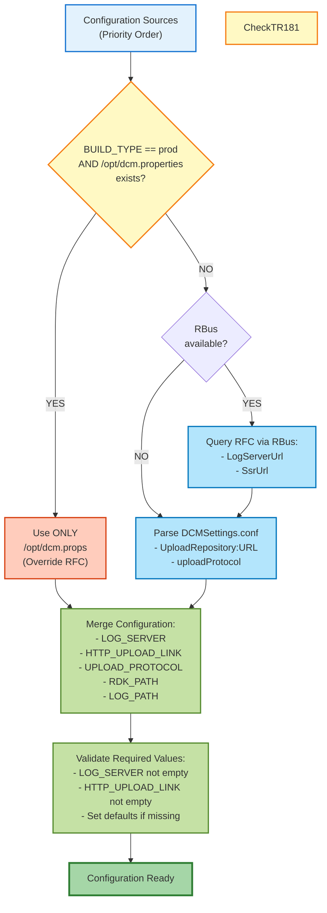
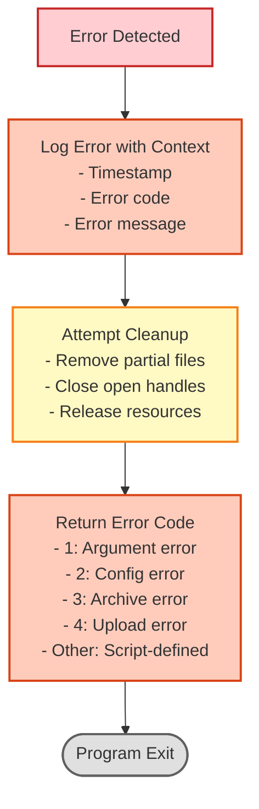

# uploadRRDLogs - High-Level Design Document

## Document Information
- **Component Name:** uploadRRDLogs (C Implementation)
- **Original Script:** uploadRRDLogs.sh
- **Version:** 1.0
- **Date:** December 1, 2025
- **Target Platform:** Embedded Linux Systems

## 1. Executive Summary

This document describes the high-level design for migrating the `uploadRRDLogs.sh` shell script to a C-based implementation. The component is responsible for collecting, archiving, and uploading Remote Debugger (RRD) diagnostic logs to a remote server for analysis. The C implementation will provide improved performance, reduced memory footprint, and better integration with the embedded system environment while maintaining full functional compatibility with the original script.

## 2. Architecture Overview

### 2.1 System Context



### 2.2 High-Level Component View

The application is structured into six major modules:

1. **Main Orchestration Layer:** Entry point and workflow coordination
2. **Configuration Manager:** Configuration loading and parsing
3. **System Info Provider:** System information gathering (MAC, timestamp)
4. **Log Processing Engine:** Directory validation and special handling
5. **Archive Manager:** Log compression and tar archive creation
6. **Upload Manager:** Upload coordination and concurrency control

### 2.3 Design Principles

- **Modularity:** Each functional area encapsulated in separate modules
- **Low Memory Footprint:** Stack allocation preferred over heap
- **Error Resilience:** Comprehensive error handling at all layers
- **Portability:** POSIX-compliant APIs, cross-platform compatible
- **Performance:** Efficient file operations and minimal overhead
- **Maintainability:** Clear interfaces and well-documented code

## 3. Module Breakdown

### 3.1 Main Orchestration Layer

**Module Name:** `rrd_upload_main`

**Purpose:** Program entry point and overall workflow coordination

**Responsibilities:**
- Parse and validate command-line arguments
- Initialize all subsystems
- Coordinate execution flow between modules
- Handle top-level error conditions
- Ensure proper cleanup and resource release
- Return appropriate exit codes

**Key Functions:**
```c
int main(int argc, char *argv[]);
int rrd_upload_orchestrate(const char *upload_dir, const char *issue_type);
void rrd_upload_cleanup(void);
```

**Workflow:**
1. Parse command-line arguments (UPLOADDIR, ISSUETYPE)
2. Initialize logging subsystem
3. Load configuration via Configuration Manager
4. Gather system information
5. Validate and prepare log directory
6. Create archive via Archive Manager
7. Upload via Upload Manager
8. Clean up resources
9. Return status code

**Error Handling:**
- Invalid arguments → Exit with code 1
- Configuration errors → Exit with appropriate code
- Upload failures → Clean up and propagate error code

**Dependencies:**
- All other modules
- Standard C library (stdio, stdlib, string)

---

### 3.2 Configuration Manager

**Module Name:** `rrd_config`

**Purpose:** Load and manage configuration from multiple sources

**Responsibilities:**
- Parse property files (key=value format)
- Query RFC parameters via RBus API
- Handle configuration priority and fallback
- Provide configuration values to other modules
- Manage configuration data structures

**Key Data Structures:**
```c
typedef struct {
    char log_server[256];
    char http_upload_link[512];
    char upload_protocol[16];
    char rdk_path[256];
    char log_path[256];
    char build_type[32];
    bool use_rfc_config;
} rrd_config_t;
```

**Key Functions:**
```c
int rrd_config_load(rrd_config_t *config);
int rrd_config_parse_properties(const char *filepath, rrd_config_t *config);
int rrd_config_query_rfc(rrd_config_t *config);
int rrd_config_parse_dcm_settings(const char *filepath, rrd_config_t *config);
const char* rrd_config_get_value(const rrd_config_t *config, const char *key);
void rrd_config_cleanup(rrd_config_t *config);
```

**Configuration Priority:**
1. RFC parameters via RBus (if available and not prod build with /opt/dcm.properties)
2. DCMSettings.conf (/tmp/DCMSettings.conf)
3. dcm.properties (/opt/dcm.properties or /etc/dcm.properties)

**Property File Format:**
```
KEY=value
KEY="value with spaces"
# Comments
```

**RFC Parameters to Query via RBus:**
- `Device.DeviceInfo.X_RDKCENTRAL-COM_RFC.LogUpload.LogServerUrl`
- `Device.DeviceInfo.X_RDKCENTRAL-COM_RFC.LogUpload.SsrUrl`

**RBus API Usage:**
```c
#include <rbus.h>

// Initialize RBus connection
rbusHandle_t handle;
rbusError_t err = rbus_open(&handle, "uploadRRDLogs");

// Get RFC parameter
rbusValue_t value;
rbusProperty_t property;
err = rbus_get(handle, "Device.DeviceInfo.X_RDKCENTRAL-COM_RFC.LogUpload.LogServerUrl", &value);
if (err == RBUS_ERROR_SUCCESS) {
    const char* serverUrl = rbusValue_GetString(value, NULL);
    // Use serverUrl
    rbusValue_Release(value);
}

// Close RBus connection
rbus_close(handle);
```

**Error Handling:**
- Missing files → Try fallback sources
- Parse errors → Log warning, use defaults
- RBus connection failure → Skip RFC query, fall back to DCM config
- Empty critical values → Return error

**Dependencies:**
- System Info Provider (for file access)
- File I/O functions
- RBus library (librbus)

---

### 3.3 System Info Provider

**Module Name:** `rrd_sysinfo`

**Purpose:** Gather system identification and status information

**Responsibilities:**
- Retrieve device MAC address
- Generate formatted timestamps
- Provide system status information
- File and directory validation
- Process and file existence checks

**Key Functions:**
```c
int rrd_sysinfo_get_mac_address(char *mac_addr, size_t size);
int rrd_sysinfo_get_timestamp(char *timestamp, size_t size);
bool rrd_sysinfo_file_exists(const char *filepath);
bool rrd_sysinfo_dir_exists(const char *dirpath);
bool rrd_sysinfo_dir_is_empty(const char *dirpath);
int rrd_sysinfo_get_dir_size(const char *dirpath, size_t *size);
```

**MAC Address Retrieval:**
- Method 1: Query TR-181 parameters via RBus
  - `Device.DeviceInfo.X_COMCAST-COM_STB_MAC` (Video platforms)
  - `Device.DeviceInfo.X_COMCAST-COM_CM_MAC` (Broadband platforms)
  - `Device.X_CISCO_COM_MACAddress` (Alternative)
- Method 2: Read from cache files (fallback)
  - `/tmp/device_details.cache` (Video platforms)
  - `/tmp/estb_mac` or `/nvram/estb_mac` (Broadband platforms)
- Method 3: Execute `getMacAddressOnly` from utils.sh (last resort)
- Format: XX:XX:XX:XX:XX:XX (colon-separated)

**Timestamp Format:**
- Pattern: `YYYY-MM-DD-HH-MM-SS[AM|PM]`
- Example: `2025-12-01-03-45-30PM`
- Use: `strftime()` with custom formatting

**File System Utilities:**
- Check file/directory existence using `access()` or `stat()`
- Validate permissions
- Check directory contents
- Get file/directory sizes

**Error Handling:**
- MAC address unavailable → Return error
- Timestamp generation failure → Return error
- File system access errors → Return appropriate error codes

**Dependencies:**
- POSIX system calls (stat, access, opendir)
- RBus library (for TR-181 parameter queries)
- Time functions (time.h)
- File I/O for cache file reading

---

### 3.4 Log Processing Engine

**Module Name:** `rrd_logproc`

**Purpose:** Validate and prepare log directories for archiving

**Responsibilities:**
- Validate source directory exists and contains files
- Handle special issue type logic (LOGUPLOAD_ENABLE)
- Convert issue type to uppercase
- Prepare working directory
- Move live logs if needed

**Key Functions:**
```c
int rrd_logproc_validate_source(const char *source_dir);
int rrd_logproc_prepare_logs(const char *source_dir, const char *issue_type);
int rrd_logproc_convert_issue_type(const char *input, char *output, size_t size);
int rrd_logproc_handle_live_logs(const char *source_dir);
```

**Validation Steps:**
1. Check directory exists
2. Check directory is readable
3. Check directory contains files (not empty)
4. Verify sufficient space in /tmp

**Issue Type Processing:**
- Convert to uppercase using `toupper()`
- Validate for filesystem safety (no special chars)
- Sanitize if necessary

**Special Handling - LOGUPLOAD_ENABLE:**
1. Check if issue type equals "LOGUPLOAD_ENABLE"
2. Look for `RRD_LIVE_LOGS.tar.gz` in `/tmp/rrd/`
3. Move file to source directory
4. Log operation (success or failure)
5. Continue even if file not found

**Error Handling:**
- Directory not found → Log and return error
- Empty directory → Log and return error
- Insufficient space → Log and return error
- File move failure → Log warning but continue

**Dependencies:**
- System Info Provider (directory checks)
- File system operations

---

### 3.5 Archive Manager

**Module Name:** `rrd_archive`

**Purpose:** Create compressed tar archive of log files

**Responsibilities:**
- Generate archive filename
- Create gzip-compressed tar archive
- Handle large file sets efficiently
- Monitor disk space during creation
- Clean up on errors

**Key Functions:**
```c
int rrd_archive_create(const char *source_dir, 
                       const char *working_dir,
                       const char *archive_filename);
int rrd_archive_generate_filename(const char *mac, 
                                  const char *issue_type,
                                  const char *timestamp,
                                  char *filename,
                                  size_t size);
int rrd_archive_cleanup(const char *archive_path);
```

**Archive Naming Convention:**
```
{MAC}_{ISSUETYPE}_{TIMESTAMP}_RRD_DEBUG_LOGS.tgz
Example: 11:22:33:44:55:66_CRASH_REPORT_2025-12-01-03-45-30PM_RRD_DEBUG_LOGS.tgz
```

**Archive Creation Approach:**

**Using libarchive Library:**
- Library: libarchive (required)
- Advantages: Native C API, efficient, portable, secure
- No shell execution, direct memory-to-file streaming
- Full control over compression and archive format
- Implementation:
  ```c
  struct archive *a = archive_write_new();
  archive_write_add_filter_gzip(a);
  archive_write_set_format_ustar(a);
  archive_write_open_filename(a, filename);
  
  // Iterate through source directory
  // For each file, create archive entry and write data
  struct archive_entry *entry = archive_entry_new();
  archive_entry_set_pathname(entry, filename);
  archive_entry_set_size(entry, file_size);
  archive_entry_set_filetype(entry, AE_IFREG);
  archive_entry_set_perm(entry, 0644);
  archive_write_header(a, entry);
  
  // Stream file data
  while ((bytes_read = read(fd, buffer, sizeof(buffer))) > 0) {
      archive_write_data(a, buffer, bytes_read);
  }
  
  archive_entry_free(entry);
  archive_write_close(a);
  archive_write_free(a);
  ```

**Implementation Considerations:**
- Stream processing to minimize memory usage
- No loading entire directory into memory
- Progress monitoring (optional)
- Atomic creation (temp file + rename)

**Error Handling:**
- Disk space exhaustion → Return error, cleanup partial files
- Permission errors → Log and return error
- Source file read errors → Log warning, continue with remaining files
- Archive write errors → Cleanup and return error

**Dependencies:**
- libarchive (required)
- File system operations
- System Info Provider

---

### 3.6 Upload Manager

**Module Name:** `rrd_upload`

**Purpose:** Coordinate log upload with concurrency control

**Responsibilities:**
- Check for concurrent upload operations (lock file)
- Retry logic for lock acquisition
- Call uploadSTBLogs library APIs for upload
- Monitor upload progress via library callbacks
- Clean up after upload (success or failure)

**Key Functions:**
```c
int rrd_upload_execute(const char *log_server,
                       const char *protocol,
                       const char *http_link,
                       const char *working_dir,
                       const char *archive_filename);
int rrd_upload_check_lock(bool *is_locked);
int rrd_upload_wait_for_lock(int max_attempts, int wait_seconds);
int rrd_upload_invoke_stb_upload(const char *log_server,
                                 const char *protocol,
                                 const char *http_link,
                                 const char *archive_filename);
int rrd_upload_cleanup_files(const char *archive_path, const char *source_dir);
```

**Concurrency Control:**
- **Lock File:** `/tmp/.log-upload.pid`
- **Check Mechanism:** Test file existence with `access()`
- **Retry Logic:**
  - Maximum attempts: 10
  - Wait interval: 60 seconds
  - Total timeout: 600 seconds (10 minutes)
- **Behavior:**
  - If lock exists: Sleep 60s, retry
  - If max attempts exceeded: Return failure
  - If no lock: Proceed with upload

**Upload Execution:**
- **Library:** `libuploadSTBLogs.so`
- **Header:** `<uploadSTBLogs.h>`
- **Method:** Direct library API calls
- **API Function:**
  ```c
  int uploadSTBLogs_upload(
      const char *log_server,
      const char *protocol,
      const char *http_upload_link,
      const char *archive_path,
      const char *working_dir,
      uploadSTBLogs_callback_t *callbacks
  );
  ```
- **Parameters:**
  - `log_server` - Server URL
  - `protocol` - HTTP or HTTPS
  - `http_upload_link` - Upload endpoint URL
  - `archive_path` - Full path to archive file
  - `working_dir` - Working directory (e.g., `/tmp/rrd/`)
  - `callbacks` - Optional progress/status callbacks
- **Return Value:** 0 on success, non-zero error code on failure

**Cleanup Operations:**
- **On Success:**
  - Remove archive file
  - Remove source directory recursively
  - Log success message
- **On Failure:**
  - Remove archive file
  - Remove source directory recursively
  - Log failure message
  - Return error code

**Error Handling:**
- Lock timeout → Return failure, cleanup
- Library API failure → Log error with API error code, cleanup
- Network errors → Captured from library return codes
- Cleanup errors → Log but don't fail if primary operation succeeded

**Dependencies:**
- System Info Provider (file operations)
- libuploadSTBLogs (upload library)
- File system operations

---

### 3.7 Logging Subsystem

**Module Name:** `rrd_log`

**Purpose:** Centralized logging using rdklogger framework

**Responsibilities:**
- Use rdklogger (RDK_LOG macro) for all logging operations
- Follow RDK standard logging practices
- Format log messages consistently with RDK conventions
- Log to remote-debugger.log via rdklogger configuration
- Thread-safe logging (provided by rdklogger)

**Key Functions:**
```c
// Initialize rdklogger
int rrd_log_init(const char *debug_ini_file);

// Logging macros (using rdklogger)
#define LOG_UPLOADRRDLOGS "LOG.RDK.UPLOADRRDLOGS"

// Use RDK_LOG macro for all logging
// RDK_LOG(level, module, format, ...)
// Example:
// RDK_LOG(RDK_LOG_INFO, LOG_UPLOADRRDLOGS, "[%s:%d] Starting upload\n", __FUNCTION__, __LINE__);
```

**Log Format:**
```
Timestamp LOG.RDK.UPLOADRRDLOGS: [function:line] message
Example: 201201-15:45:30.123 [INFO] LOG.RDK.UPLOADRRDLOGS: [rrd_upload_orchestrate:145] Starting log upload for CRASH_REPORT
```

**Note:** Timestamp format and prefix are automatically handled by rdklogger framework

**Log Levels (rdklogger):**
- `RDK_LOG_TRACE1`: Entry/Exit tracing
- `RDK_LOG_DEBUG`: Debug information
- `RDK_LOG_INFO`: Normal operational messages
- `RDK_LOG_WARN`: Warning conditions
- `RDK_LOG_ERROR`: Error conditions
- `RDK_LOG_FATAL`: Fatal errors (not typically used)

**Log File Configuration:**
- Module: `LOG.RDK.UPLOADRRDLOGS`
- Configuration: Via debug.ini file (rdklogger config)
- Default Path: `$LOG_PATH/remote-debugger.log` (shared with RRD daemon)
- Rotation: Handled by rdklogger/logrotate
- Log level: Configured via debug.ini or RFC

**Implementation:**
```c
#include <rdk_debug.h>

// Initialization in main()
int main(int argc, char *argv[]) {
    // Initialize rdklogger with debug.ini configuration
    rdk_logger_init("/etc/debug.ini");
    
    // Log messages using RDK_LOG macro
    RDK_LOG(RDK_LOG_INFO, LOG_UPLOADRRDLOGS, 
            "[%s:%d] uploadRRDLogs started\n", __FUNCTION__, __LINE__);
    
    // ... rest of program
}

// Example logging throughout code
void rrd_upload_execute() {
    RDK_LOG(RDK_LOG_DEBUG, LOG_UPLOADRRDLOGS,
            "[%s:%d] Checking upload lock\n", __FUNCTION__, __LINE__);
    
    if (error_condition) {
        RDK_LOG(RDK_LOG_ERROR, LOG_UPLOADRRDLOGS,
                "[%s:%d] Upload failed: %s\n", __FUNCTION__, __LINE__, strerror(errno));
    }
}
```

**Features:**
- Thread-safe (built into rdklogger)
- Automatic timestamp and module prefix
- Configurable log levels via debug.ini
- RFC-based log level control
- Automatic log rotation support

**Dependencies:**
- rdklogger library (rdk_debug.h)
- debug.ini configuration file

---

## 4. Data Flow

### 4.1 Primary Data Flow



### 4.2 Configuration Data Flow



### 4.3 Error Flow



## 5. Key Algorithms and Data Structures

### 5.1 Configuration Parser Algorithm

**Purpose:** Parse key=value property files

**Algorithm:**
```
FUNCTION parse_property_file(filepath, config_struct):
    OPEN file for reading
    IF file not accessible THEN
        RETURN error_code
    END IF
    
    // Track which required properties have been found
    found_count = 0
    required_properties = ["LOG_SERVER", "HTTP_UPLOAD_LINK", "UPLOAD_PROTOCOL", 
                          "RDK_PATH", "LOG_PATH", "BUILD_TYPE"]
    total_required = LENGTH(required_properties)
    
    FOR each line in file:
        TRIM whitespace
        IF line is empty OR starts with '#' THEN
            CONTINUE  // Skip comments and empty lines
        END IF
        
        SPLIT line on '=' into key and value
        IF split failed THEN
            LOG warning "Malformed line"
            CONTINUE
        END IF
        
        REMOVE quotes from value if present
        TRIM whitespace from key and value
        
        MATCH key:
            CASE "LOG_SERVER":
                IF config_struct.log_server is empty THEN
                    COPY value to config_struct.log_server
                    found_count++
                END IF
            CASE "HTTP_UPLOAD_LINK":
                IF config_struct.http_upload_link is empty THEN
                    COPY value to config_struct.http_upload_link
                    found_count++
                END IF
            CASE "UPLOAD_PROTOCOL":
                IF config_struct.upload_protocol is empty THEN
                    COPY value to config_struct.upload_protocol
                    found_count++
                END IF
            CASE "RDK_PATH":
                IF config_struct.rdk_path is empty THEN
                    COPY value to config_struct.rdk_path
                    found_count++
                END IF
            CASE "LOG_PATH":
                IF config_struct.log_path is empty THEN
                    COPY value to config_struct.log_path
                    found_count++
                END IF
            CASE "BUILD_TYPE":
                IF config_struct.build_type is empty THEN
                    COPY value to config_struct.build_type
                    found_count++
                END IF
            // ... other cases
        END MATCH
        
        // Early exit optimization: if all required properties found, stop parsing
        IF found_count >= total_required THEN
            LOG debug "All required properties found, early exit"
            BREAK
        END IF
    END FOR
    
    CLOSE file
    RETURN success
END FUNCTION
```

**Data Structure:**
```c
typedef struct {
    char log_server[256];
    char http_upload_link[512];
    char upload_protocol[16];
    char rdk_path[256];
    char log_path[256];
    char build_type[32];
    bool use_rfc_config;
} rrd_config_t;
```

### 5.2 MAC Address Retrieval Algorithm

**Purpose:** Get device MAC address using standard TR-181 parameters with cache fallback

**Algorithm:**
```
FUNCTION get_mac_address(output_buffer, buffer_size):
    // Method 1: Query TR-181 parameter via RBus
    // Device.DeviceInfo.X_COMCAST-COM_STB_MAC (Video platforms)
    // Device.DeviceInfo.X_COMCAST-COM_CM_MAC (Broadband platforms)
    // Device.X_CISCO_COM_MACAddress (Alternative)
    
    tr181_params = [
        "Device.DeviceInfo.X_COMCAST-COM_STB_MAC",
        "Device.DeviceInfo.X_COMCAST-COM_CM_MAC",
        "Device.X_CISCO_COM_MACAddress"
    ]
    
    IF rbus_handle_available THEN
        FOR each param in tr181_params:
            result = rbus_get(rbus_handle, param, &value)
            IF result == SUCCESS AND value not empty THEN
                mac_address = rbusValue_GetString(value)
                IF mac_address is valid format THEN
                    COPY mac_address to output_buffer
                    rbusValue_Release(value)
                    RETURN success
                END IF
                rbusValue_Release(value)
            END IF
        END FOR
    END IF
    
    // Method 2: Read from device cache files (fallback)
    // Video platforms: /tmp/device_details.cache
    // Broadband platforms: /tmp/estb_mac or /nvram/estb_mac or equivalent
    
    cache_files = [
        "/tmp/device_details.cache",     // Video
        "/tmp/estb_mac",                 // Broadband
        "/nvram/estb_mac",               // Broadband persistent
        "/tmp/.deviceDetails.cache"      // Alternative
    ]
    
    FOR each cache_file in cache_files:
        IF file_exists(cache_file) THEN
            OPEN cache_file for reading
            FOR each line in file:
                // Look for MAC address patterns
                // Format 1: MAC=XX:XX:XX:XX:XX:XX
                // Format 2: estb_mac=XX:XX:XX:XX:XX:XX
                // Format 3: Just the MAC address
                
                IF line matches "MAC=" OR "estb_mac=" THEN
                    EXTRACT value after '='
                    IF value is valid MAC format THEN
                        COPY value to output_buffer
                        CLOSE file
                        RETURN success
                    END IF
                ELSE IF line matches MAC address pattern THEN
                    IF line is valid MAC format THEN
                        COPY line to output_buffer
                        CLOSE file
                        RETURN success
                    END IF
                END IF
            END FOR
            CLOSE file
        END IF
    END FOR
    
    // Method 3: Execute getMacAddressOnly utility (last resort)
    IF file_exists("$RDK_PATH/utils.sh") THEN
        EXECUTE "$RDK_PATH/utils.sh getMacAddressOnly"
        IF execution succeeds AND output valid THEN
            COPY output to buffer
            RETURN success
        END IF
    END IF
    
    LOG error "Failed to retrieve MAC address from all sources"
    RETURN error_no_mac_found
END FUNCTION
```

### 5.3 Upload Lock Management Algorithm

**Purpose:** Prevent concurrent uploads with retry logic

**Algorithm:**
```
FUNCTION wait_for_upload_lock(max_attempts, wait_seconds):
    attempt = 1
    
    WHILE attempt <= max_attempts:
        IF NOT file_exists("/tmp/.log-upload.pid") THEN
            // Lock is free
            RETURN success
        ELSE
            // Lock held by another process
            LOG "Upload lock detected, waiting..."
            SLEEP wait_seconds
            attempt = attempt + 1
        END IF
    END WHILE
    
    // Max attempts exceeded
    LOG "Upload lock timeout after max attempts"
    RETURN error_lock_timeout
END FUNCTION

FUNCTION execute_upload_with_lock(parameters):
    result = wait_for_upload_lock(10, 60)
    IF result != success THEN
        RETURN result
    END IF
    
    // Lock is free, proceed with upload
    result = invoke_upload_script(parameters)
    RETURN result
END FUNCTION
```

### 5.4 Archive Filename Generation Algorithm

**Purpose:** Generate standardized archive filename

**Algorithm:**
```
FUNCTION generate_archive_filename(mac, issue_type, timestamp, output_buffer, size):
    // Sanitize MAC: remove colons
    sanitized_mac = REPLACE(mac, ":", "")
    
    // Ensure issue_type is uppercase
    uppercase_issue = TO_UPPERCASE(issue_type)
    
    // Format: {MAC}_{ISSUETYPE}_{TIMESTAMP}_RRD_DEBUG_LOGS.tgz
    result = SNPRINTF(output_buffer, size,
                      "%s_%s_%s_RRD_DEBUG_LOGS.tgz",
                      sanitized_mac,
                      uppercase_issue,
                      timestamp)
    
    IF result < 0 OR result >= size THEN
        RETURN error_buffer_too_small
    END IF
    
    RETURN success
END FUNCTION
```

### 5.5 Directory Validation Algorithm

**Purpose:** Validate source directory for archiving

**Algorithm:**
```
FUNCTION validate_source_directory(dir_path):
    // Check existence
    IF NOT dir_exists(dir_path) THEN
        LOG "Directory does not exist: " + dir_path
        RETURN error_not_found
    END IF
    
    // Check readable
    IF NOT dir_readable(dir_path) THEN
        LOG "Directory not readable: " + dir_path
        RETURN error_permission
    END IF
    
    // Check not empty
    IF dir_is_empty(dir_path) THEN
        LOG "Directory is empty: " + dir_path
        RETURN error_empty_directory
    END IF
    
    // Check disk space in /tmp
    available_space = get_available_space("/tmp")
    dir_size = get_directory_size(dir_path)
    required_space = dir_size * 1.2  // 20% overhead for compression
    
    IF available_space < required_space THEN
        LOG "Insufficient disk space"
        RETURN error_insufficient_space
    END IF
    
    RETURN success
END FUNCTION
```

## 6. Interfaces and Integration Points

### 6.1 Command-Line Interface

**Synopsis:**
```
uploadRRDLogs UPLOADDIR ISSUETYPE
```

**Arguments:**
- `UPLOADDIR`: Path to directory containing debug logs
- `ISSUETYPE`: Issue classification string

**Exit Codes:**
- `0`: Success
- `1`: Invalid arguments
- `2`: Configuration error
- `3`: Archive creation error
- `4`: Upload error
- `5`: Cleanup error

**Environment Variables Required:**
- `RDK_PATH`: Path to RDK utilities
- `LOG_PATH`: Path for log files

**Example Usage:**
```bash
export RDK_PATH=/lib/rdk
export LOG_PATH=/opt/logs
./uploadRRDLogs /tmp/rrd_logs/ crash_report
```

### 6.2 File System Interface

**Input Files:**
| Path | Purpose | Required | Format |
|------|---------|----------|--------|
| /etc/include.properties | System properties | Yes | key=value |
| /etc/device.properties | Device config | Yes | key=value |
| /tmp/DCMSettings.conf | DCM settings | No | key=value |
| /opt/dcm.properties | DCM fallback | Conditional | key=value |
| /etc/dcm.properties | DCM fallback | Conditional | key=value |

**Output Files:**
| Path | Purpose | Lifetime |
|------|---------|----------|
| /tmp/rrd/{archive}.tgz | Log archive | Temporary (deleted after upload) |
| $LOG_PATH/remote-debugger.log | Operation log | Persistent (external rotation) |

**Working Directories:**
| Path | Purpose |
|------|---------|
| /tmp/rrd/ | Archive creation workspace |
| {UPLOADDIR} | Source log files |

### 6.3 uploadSTBLogs Library Interface

**libuploadSTBLogs API:**

**Library:** `libuploadSTBLogs.so`

**Header:** `#include <uploadSTBLogs.h>`

**Primary Upload Function:**
```c
int uploadSTBLogs_upload(
    const char *log_server,
    const char *protocol,
    const char *http_upload_link,
    const char *archive_path,
    const char *working_dir,
    uploadSTBLogs_callback_t *callbacks
);
```

**Parameters:**
- `log_server` - Server URL (e.g., "logs.example.com")
- `protocol` - "HTTP" or "HTTPS"
- `http_upload_link` - Upload endpoint URL path
- `archive_path` - Absolute path to archive file to upload
- `working_dir` - Working directory for upload operation
- `callbacks` - Optional callback structure for progress updates

**Callback Structure:**
```c
typedef struct {
    void (*on_progress)(int percent, void *user_data);
    void (*on_status)(const char *message, void *user_data);
    void (*on_error)(int error_code, const char *message, void *user_data);
    void *user_data;
} uploadSTBLogs_callback_t;
```

**Return Values:**
- `0` - Upload successful
- `UPLOAD_ERR_NETWORK` - Network error
- `UPLOAD_ERR_SERVER` - Server rejected upload
- `UPLOAD_ERR_FILE` - File access error
- `UPLOAD_ERR_AUTH` - Authentication failure
- `UPLOAD_ERR_TIMEOUT` - Operation timeout

**Concurrency Control:**
- Library internally manages `/tmp/.log-upload.pid` lock file
- Caller should use `rrd_upload_wait_for_lock()` before calling upload API
- Library cleans up lock file on completion or error

**Thread Safety:**
- Library is thread-safe
- Multiple concurrent uploads from different processes prevented by lock file
- Can be called from any thread within the same process

**Example Usage:**
```c
uploadSTBLogs_callback_t callbacks = {
    .on_progress = upload_progress_callback,
    .on_status = upload_status_callback,
    .on_error = upload_error_callback,
    .user_data = NULL
};

int result = uploadSTBLogs_upload(
    config->log_server,
    config->upload_protocol,
    config->http_upload_link,
    archive_path,
    "/tmp/rrd/",
    &callbacks
);

if (result != 0) {
    rrd_log_error("Upload failed with error code: %d", result);
    return result;
}
```

### 6.4 RBus Interface

**RBus API Interface:**

**Library:** librbus (link with `-lrbus`)

**Header:** `#include <rbus.h>`

**Initialization:**
```c
rbusHandle_t handle;
rbusError_t err = rbus_open(&handle, "uploadRRDLogs");
if (err != RBUS_ERROR_SUCCESS) {
    // RBus not available, fall back to DCM config
}
```

**Parameters to Query:**
- `Device.DeviceInfo.X_RDKCENTRAL-COM_RFC.LogUpload.LogServerUrl`
- `Device.DeviceInfo.X_RDKCENTRAL-COM_RFC.LogUpload.SsrUrl`

**Query Function:**
```c
int rrd_config_query_rbus_param(rbusHandle_t handle, const char* param, char* output, size_t size) {
    rbusValue_t value;
    rbusError_t err = rbus_get(handle, param, &value);
    
    if (err != RBUS_ERROR_SUCCESS) {
        return -1;  // Parameter not available
    }
    
    const char* str_value = rbusValue_GetString(value, NULL);
    if (str_value != NULL && strlen(str_value) > 0) {
        strncpy(output, str_value, size - 1);
        output[size - 1] = '\0';
        rbusValue_Release(value);
        return 0;
    }
    
    rbusValue_Release(value);
    return -1;  // Empty value
}
```

**Cleanup:**
```c
rbus_close(handle);
```

**Error Handling:**
- RBus not initialized: Skip RFC query
- Parameter query fails: Use DCM configuration fallback
- Empty result: Use DCM configuration fallback
- Connection errors: Log warning, continue with fallback config

### 6.5 Logging Interface

**Logging Framework:** rdklogger

**Module Name:** `LOG.RDK.UPLOADRRDLOGS`

**Header:** `#include <rdk_debug.h>`

**Initialization:**
```c
rdk_logger_init("/etc/debug.ini");
```

**Log Entry Format:**
```
YYMMDD-HH:MM:SS.mmm [LEVEL] LOG.RDK.UPLOADRRDLOGS: [function:line] message
```

**Example Entries:**
```
201201-15:45:30.123 [INFO] LOG.RDK.UPLOADRRDLOGS: [rrd_upload_orchestrate:145] Starting log upload for CRASH_REPORT
201201-15:45:32.456 [INFO] LOG.RDK.UPLOADRRDLOGS: [rrd_archive_create:89] Archive created: 112233445566_CRASH_REPORT_2025-12-01-03-45-30PM_RRD_DEBUG_LOGS.tgz
201201-15:46:15.789 [INFO] LOG.RDK.UPLOADRRDLOGS: [rrd_upload_execute:234] Upload successful
201201-15:46:16.012 [ERROR] LOG.RDK.UPLOADRRDLOGS: [rrd_upload_cleanup_files:301] Failed to remove archive file: Permission denied
```

**Log Levels:**
- `RDK_LOG_TRACE1`: Function entry/exit tracing
- `RDK_LOG_DEBUG`: Detailed debug information
- `RDK_LOG_INFO`: Normal operational messages
- `RDK_LOG_WARN`: Warning conditions
- `RDK_LOG_ERROR`: Error conditions

**Configuration:**
- **File:** `/etc/debug.ini`
- **Module Section:** `[LOG.RDK.UPLOADRRDLOGS]`
- **Log Levels:** Configurable per module
- **Output:** Shared log file `$LOG_PATH/remote-debugger.log`

**Example debug.ini Configuration:**
```ini
[LOG.RDK.UPLOADRRDLOGS]
LOG_LEVEL=4
APPENDER=FILE
FILE=/opt/logs/remote-debugger.log
FILE_SIZE=10240
FILE_COUNT=5
```

## 7. Error Handling Strategy

### 7.1 Error Categories

**Category 1: Fatal Errors (Immediate Exit)**
- Invalid command-line arguments
- Critical configuration missing (LOG_SERVER, HTTP_UPLOAD_LINK)
- Unable to initialize logging
- Out of memory

**Category 2: Recoverable Errors (Retry/Fallback)**
- RBus query failure → Fall back to DCM config
- uploadSTBLogs.sh busy → Retry with timeout
- Temporary file I/O error → Retry operation

**Category 3: Warning Conditions (Log and Continue)**
- Optional configuration file missing
- RRD_LIVE_LOGS.tar.gz not found for LOGUPLOAD_ENABLE
- Non-critical file in source directory unreadable

### 7.2 Error Codes

| Code | Category | Description |
|------|----------|-------------|
| 0 | Success | Operation completed successfully |
| 1 | Fatal | Invalid command-line arguments |
| 2 | Fatal | Configuration error |
| 3 | Fatal | Archive creation failed |
| 4 | Recoverable | Upload failed |
| 5 | Warning | Cleanup failed (after successful upload) |

### 7.3 Error Handling Pattern

```c
int function_that_can_fail() {
    int result;
    
    // Attempt operation
    result = risky_operation();
    if (result != 0) {
        // Log error with context
        rrd_log_error("Operation failed: %s (errno=%d)", 
                      strerror(errno), errno);
        
        // Attempt cleanup
        cleanup_partial_work();
        
        // Return error code
        return ERROR_OPERATION_FAILED;
    }
    
    return SUCCESS;
}
```

### 7.4 Resource Cleanup Pattern

```c
int main_function() {
    resource_t *res1 = NULL;
    resource_t *res2 = NULL;
    int result = SUCCESS;
    
    // Allocate resources
    res1 = allocate_resource1();
    if (res1 == NULL) {
        result = ERROR_ALLOCATION;
        goto cleanup;
    }
    
    res2 = allocate_resource2();
    if (res2 == NULL) {
        result = ERROR_ALLOCATION;
        goto cleanup;
    }
    
    // Perform operations
    result = do_work(res1, res2);
    
cleanup:
    // Always clean up resources
    if (res2 != NULL) {
        free_resource2(res2);
    }
    if (res1 != NULL) {
        free_resource1(res1);
    }
    
    return result;
}
```

## 8. Performance Considerations

### 8.1 Memory Usage Optimization

**Techniques:**
1. **Stack Allocation:** Use stack for small, fixed-size buffers
2. **Buffer Reuse:** Reuse buffers across operations
3. **Streaming:** Process files without loading into memory
4. **Early Cleanup:** Free resources as soon as no longer needed

**Memory Budget:**
- Configuration data: ~2 KB
- Path buffers: ~2 KB
- Archive operations: Streaming (minimal memory)
- Total target: < 100 KB resident memory

### 8.2 I/O Optimization

**Strategies:**
1. **Sequential Reads:** Read files sequentially for tar operations
2. **Buffered I/O:** Use appropriate buffer sizes (8-64 KB)
3. **Minimize Seeks:** Avoid random access patterns
4. **Batch Operations:** Group file operations where possible

### 8.3 CPU Optimization

**Techniques:**
1. **Efficient String Operations:** Use memcpy/memmove instead of strcpy for known lengths
2. **Avoid Redundant Parsing:** Parse configuration once, cache results
3. **Minimize System Calls:** Batch operations where possible
4. **Compression:** Let tar/gzip handle compression (efficient implementation)

### 8.4 Execution Time Targets

| Operation | Target Time | Notes |
|-----------|-------------|-------|
| Initialization | < 1 second | Config loading, validation |
| Archive Creation | Variable | Depends on log size (~5 MB/s) |
| Upload | Variable | Network-dependent |
| Cleanup | < 1 second | File deletion |
| Total (100 MB logs) | < 5 minutes | Excludes network upload time |

## 9. Security Considerations

### 9.1 Input Validation

**Command-Line Arguments:**
- Validate UPLOADDIR path doesn't contain `..` (directory traversal)
- Sanitize ISSUETYPE for filesystem safety
- Check argument lengths to prevent buffer overflows

**Configuration Values:**
- Validate URLs for proper format
- Check path values for dangerous characters
- Limit string lengths

### 9.2 File Operations

**Secure Practices:**
- Create temporary files with mode 0600 (owner read/write only)
- Use absolute paths to prevent race conditions
- Validate symbolic links before following
- Check file permissions before operations

### 9.3 Process Execution

**Security Measures:**
- Use `execv()` family instead of `system()` where possible
- Sanitize arguments passed to external scripts
- Set minimal environment for child processes
- Validate executables before execution (check permissions, ownership)

### 9.4 Sensitive Data Handling

**Considerations:**
- MAC address in filename: Consider hashing if privacy required
- Log contents: May contain sensitive debug information
- Credentials: Never log server credentials
- Temporary files: Clean up promptly, use secure permissions

### 9.5 Network Security

**Best Practices:**
- Prefer HTTPS over HTTP for uploads
- Validate server certificates (if implementing TLS)
- Use timeout for network operations
- Avoid credential exposure in URLs

## 10. Platform Portability

### 10.1 POSIX Compliance

**Required Standards:**
- POSIX.1-2008 (base specification)
- C99 (minimum), C11 (preferred)
- Large File Support (LFS) for files > 2GB

**System Calls:**
- Use POSIX-compliant functions
- Avoid Linux-specific extensions where possible
- Provide fallbacks for optional features

### 10.2 Cross-Platform Considerations

**File Paths:**
- Use `/` as path separator (POSIX standard)
- Support paths up to PATH_MAX (4096 bytes)
- Handle long filenames (NAME_MAX = 255)

**Endianness:**
- Not a concern (text-based protocols and files)
- Binary operations: Use network byte order if needed

**Architecture:**
- Support 32-bit and 64-bit systems
- Use standard integer types (int32_t, uint64_t, etc.)
- Avoid architecture-specific assumptions

### 10.3 Compiler Compatibility

**Target Compilers:**
- GCC 4.8+ (primary)
- Clang 3.5+ (secondary)
- Cross-compilers: ARM, MIPS, x86 variants

**Compilation Flags:**
- `-std=c99` or `-std=c11`
- `-Wall -Wextra -Werror` (strict warnings)
- `-Os` (optimize for size on embedded platforms)
- `-D_LARGEFILE64_SOURCE` (large file support)

### 10.4 Build System

**Autotools Configuration:**
```
configure.ac additions:
- Check for librbus (required)
- Check for libarchive (required)
- Detect system properties files locations
- Support cross-compilation
```

**Makefile.am:**
```makefile
bin_PROGRAMS = uploadRRDLogs
uploadRRDLogs_SOURCES = rrd_main.c rrd_config.c rrd_sysinfo.c \
                        rrd_logproc.c rrd_archive.c rrd_upload.c \
                        rrd_log.c
uploadRRDLogs_CFLAGS = -Wall -Wextra -Os -std=c99
uploadRRDLogs_LDFLAGS = -lrbus -larchive -luploadSTBLogs -lrdkloggers
```

## 11. Dependencies Matrix

| Module | Depends On | External Libraries | System Calls |
|--------|------------|-------------------|--------------|
| rrd_main | All modules | stdlib, stdio | - |
| rrd_config | rrd_sysinfo, rrd_log | string, rbus | fopen, fgets, rbus_open/get/close |
| rrd_sysinfo | rrd_log | string, time, net | stat, access, opendir, ioctl |
| rrd_logproc | rrd_sysinfo, rrd_log | string | stat, opendir |
| rrd_archive | rrd_sysinfo, rrd_log | libarchive | archive_write_* |
| rrd_upload | rrd_sysinfo, rrd_log | libuploadSTBLogs | uploadSTBLogs_upload |
| rrd_log | - | rdklogger | RDK_LOG, rdk_logger_init |

**Required Dependencies:**
- **librbus:** For RFC parameter queries via RBus IPC
- **libarchive:** For tar.gz archive creation with gzip compression
- **libuploadSTBLogs:** For log upload operations to remote server
- **librdkloggers:** For RDK standard logging framework

**Fallback Strategies:**
- RBus connection failure → Use DCM configuration only
- libuploadSTBLogs unavailable → Build failure (required at compile time)
- libarchive unavailable → Build failure (required at compile time)

## 12. Testing Strategy

### 12.1 Unit Testing

**Test Framework:** Google Test (gtest/gmock)

**Modules to Test:**
- Configuration parser (various file formats)
- MAC address retrieval (with mocked interfaces)
- Timestamp generation
- Filename generation
- Directory validation
- Lock management logic

**Test Coverage Target:** > 80%

### 12.2 Integration Testing

**Test Scenarios:**
1. End-to-end successful upload
2. Configuration fallback chain
3. Lock file contention (multiple instances)
4. Empty directory handling
5. Archive creation for various log sizes
6. Upload failure and retry
7. Cleanup on success and failure

### 12.3 Platform Testing

**Target Platforms:**
- ARM 32-bit embedded Linux
- ARM 64-bit embedded Linux
- MIPS embedded Linux
- x86_64 Linux (development)

**Validation:**
- Memory usage profiling (valgrind, massif)
- Binary size check (< 500KB preferred)
- Performance benchmarking
- Resource leak detection

### 12.4 Error Injection Testing

**Inject Errors:**
- Missing configuration files
- Disk full conditions
- Network unavailability
- Permission errors
- Malformed input data
- Lock file timeout

## 13. Migration Compatibility

### 13.1 Behavioral Compatibility

**Must Maintain:**
- Identical command-line interface
- Same exit codes for common scenarios
- Log format compatibility
- Archive naming convention
- Compatible with uploadSTBLogs library implementation

**Allowed Changes:**
- Performance improvements
- Better error messages
- Additional debug logging (if enabled)

### 13.2 Configuration Compatibility

**Must Support:**
- All property file formats
- RFC parameters via RBus API
- DCM configuration sources
- Priority and fallback order

**Deprecated:**
- None (all features retained)

### 13.3 Deployment Strategy

**Phase 1: Side-by-Side Testing**
- Install C version as `uploadRRDLogs_c`
- Run both versions in parallel
- Compare outputs and logs

**Phase 2: Gradual Rollout**
- Deploy to subset of devices
- Monitor for issues
- Collect performance metrics

**Phase 3: Full Replacement**
- Replace shell script with C binary
- Update systemd units / init scripts
- Remove shell script dependency

## Document Revision History

| Version | Date | Author | Changes |
|---------|------|--------|---------|
| 1.0 | December 1, 2025 | GitHub Copilot | Initial HLD document |
